<a name="HOLTitle"></a>
# Using Azure SQL Database #

---

<a name="Overview"></a>
## Overview ##

[Azure SQL Database](https://azure.microsoft.com/en-us/services/sql-database/) is a cloud-based relational database service based on Microsoft's SQL Server engine. It delivers predictable performance, dynamic scalability, and robust data protection so you can focus on app development rather than managing virtual machines and physical infrastructure. SQL Database supports existing SQL Server tools, libraries, and APIs, making it simple to migrate existing database solutions to the cloud and to use those solutions without climbing a learning curve. And it features the largest compliance portfolio in the industry, including [HIPAA](https://www.microsoft.com/en-us/trustcenter/Compliance/HIPAA), [FERPA](https://www.microsoft.com/en-us/trustcenter/Compliance/FERPA), and even [Singapore MTCS Level 3](https://www.microsoft.com/en-us/TrustCenter/Compliance/MTCS).

One of the advantages of running SQL Database on Microsoft Azure is being able to scale performance up or down, manually or automatically, to quickly adapt to changing demand. SQL Database features a broad spectrum of performance levels, with each level offering guaranteed performance. It also offers [elastic pools](https://docs.microsoft.com/azure/sql-database/sql-database-design-patterns-multi-tenancy-saas-applications) for hosting multitenant apps without the usual trade-off in performance, management, and security.  

In this lab, you will create an Azure SQL Database and populate it with records. You will create an Azure API App to communicate with the database, create a Universal Windows Platform app to access the APIs, and use features of SQL Database to limit the information returned to users based on their role in the organization.

<a name="Objectives"></a>
### Objectives ###

In this hands-on lab, you will learn how to:

- Create an Azure SQL Database
- Populate an Azure SQL Database with records
- Access Azure SQL Database records from your apps
- Filter and mask records based on user permissions

<a name="Prerequisites"></a>
### Prerequisites ###

The following are required to complete this hands-on lab:

- An active Microsoft Azure subscription. If you don't have one, [sign up for a free trial](http://aka.ms/WATK-FreeTrial).
- [Visual Studio 2015 Community edition](https://www.visualstudio.com/en-us/products/visual-studio-community-vs.aspx) or higher with the Windows 10 SDK installed
- [SQL Server Data Tools for Visual Studio 2015](https://msdn.microsoft.com/en-us/library/mt204009.aspx)

---

<a name="Exercises"></a>
## Exercises ##

This hands-on lab includes the following exercises:

- [Exercise 1: Create an Azure SQL Database](#Exercise1)
- [Exercise 2: Add records to the database](#Exercise2)
- [Exercise 3: Create an Azure SQL Database API service](#Exercise3)
- [Exercise 4: Build an API-aware Windows Store app](#Exercise4)
- [Exercise 5: Manage record permissions and masks](#Exercise5)
 
Estimated time to complete this lab: **60** minutes.

<a name="Exercise1"></a>
## Exercise 1: Create an Azure SQL Database ##

The first step in working with Azure SQL Database is to create a database to hold your data. In this exercise, you will create an Azure SQL Database and configure database server settings.

1. Open the [Azure Portal](https://portal.azure.com) in your browser. If you are asked to sign in, do so with your Microsoft Account.

1. Click **+ New**, followed by **Database** and **SQL Database**.

    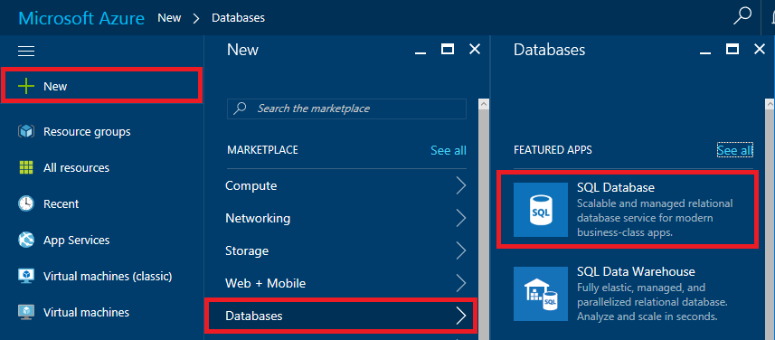

    _Creating a new Azure SQL Database_

1. In the "SQL Database" blade, enter "Northwind" (without quotation marks) as the database name. Select **Create new** under **Resource group** and name the resource group "SQLDatabaseResourceGroup." Leave **Select source** set to **Blank database** and click **Server - Configure required settings**.

	> Using the name "Northwind" for your database is required for the exercises in this lab.

    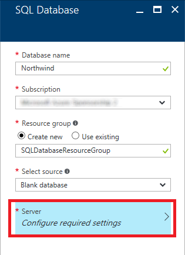

    _Configuring an Azure SQL Database_

1. Click **Create a new server**. In the "New Server" blade, enter a unique name for **Server name** and make sure a green check mark appears next to it. (You can only use numbers and lowercase letters since the name becomes part of a DNS name.) Specify "sqladmin" as the user name and "Password_1" as the password. Select the location nearest you, and then click the **Select** button. 
 
    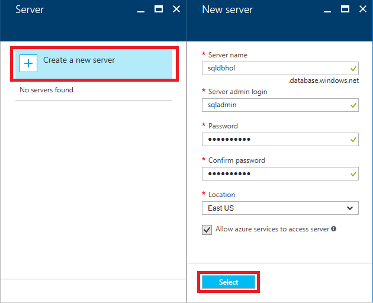

    _Creating a database server_
	
1. Click the **Create** button at the bottom of the "SQL Database" blade.
 
    

    _Creating the database_	

1. Click **Resource groups** in the ribbon on the left side of the portal, and then click the resource group created for the SQL Database.
 
    

    _Opening the resource group_

1. Wait until "Deploying" changes to "Succeeded," indicating that the SQL Database has been deployed.

	> Refresh the page in the browser every now and then to update the deployment status. Clicking the **Refresh** button in the resource-group blade refreshes the list of resources in the resource group, but does not reliably update the deployment status.

    

    _Viewing the deployment status_

Your Azure SQL Database is now provisioned and ready to be populated with data. For that, you will use the SQL Server Data Tools for Visual Studio 2015.

<a name="Exercise2"></a>
## Exercise 2: Add records to the database ##

Now that you’ve created an Azure SQL Database, it’s time to populate your database with records. In this exercise you’ll be populating the Northwind database created in Exercise 1 with customer, product and order records using the SQL Server Data Tools (SSDT) in Visual Studio. If you haven’t installed SSDT you will need to do so before continuing with this exercise.

Once you have confirmed the SQL Server Data Tools have been added to Visual Studio, you can open your Azure SQL Database easily through the Azure Portal. To open your database in SSDT:

1. Open the Azure Portal dashboard (if it’s not already open from Exercise 1) and click the **“hamburger”** icon to open the side drawer menu.

1. Click **Resource Groups** followed by **TrainingLabResources**.

1. Select the **Overview** tab.

1. Click **Northwind** to open your newly provisioned Azure SQL Database.
 
    

    _Selecting the Northwind database_	

1. Click **Tools** in the top menu of the **Overview** panel. The Tools panel will contain a number of tools. Click the **Open in Visual Studio** tool and the click the **Open in Visual Studio** button. 
 
    

    _The Open in Visual Studio tool_	
 
	>You may be prompted to allow the Microsoft Visual Studio Web Protocol Handler to switch from your browser to Visual Studio. Click **Yes**.
	
1. After a short delay, Visual Studio 2015 will open and display a "Connect" dialog, prepopulated with configuration information from your Azure SQL Database. Enter the **database password** created in the previous exercise (“Password_1”) check **Remember password**, and click **Connect**. 
 
    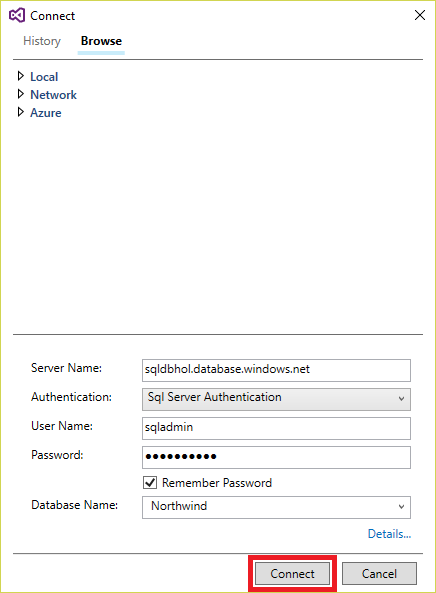

    _The Visual Studio Connect dialog_	

1. The "Create new firewall rule" dialog will display, prompting to allow local firewall access between your local computer and your Azure SQL Database. Review the default settings and click **OK**. Visual Studio will now load your database in the SQL Server Object Explorer (SSOE) and begin populating database information.

    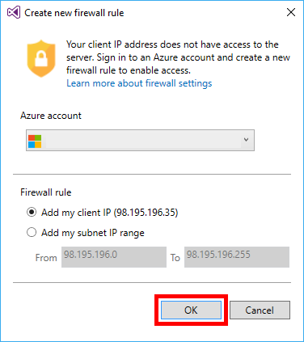

    _The Visual Studio Firewall rule dialog_	

	 >If prompted to login to the portal do so with your Microsoft account.

1. Right-click over the **newly added server mode** displaying the full path of your new Azure SQL Database server (such as traininglab01.database.windows.net) in the SSOE and select **New Query…** after which a new query script window will open in the main content panel of your environment.
 
    

    _Selecting the New Query command_	

1. From the Visual Studio menu select **Edit > Insert File as Text** and browse to the **Resources > Scripts** folder included with this lab.
 
    

    _Selecting the Insert File as Text command_	

1. Select the **Create MASTER logins.sql** script and click **Open**. 
 
    

    _Opening the Create MASTER logins script_	

1. When the script loads in the main Visual Studio pane, right-click over **any area in the script** and select **Execute**.
 
    

    _Executing the Create MASTER logins script_	

	>This script will create the user logins needed for the remaining exercises. When the script has completed executing a Query completed message will appear at the bottom of the query windows.
 
    

    _Query executed succesfully message_	
	
1. Expand the server **Databases** node and then right-click over the **Northwind** database node and then select **New Query…** after which another new query script window will open in the main content panel of your environment.
 
    

    _Selecting the New Query command_	

1. From the Visual Studio menu select **Edit > Insert File as Text** and browse to the** Resources > Scripts** folder included with this lab.

1. Select the **Create NORTHWIND tables.sql** script and click **Open**.
 
    

    _Opening the Create NORTHWIND tables script_	

1. When the script loads in the main Visual Studio pane, right-click over **any area in the script** and select **Execute**.
 
    

    _Executing the Create NORTHWIND tables script_	

	>This script will create the tables and other dependent objects needed for the remaining exercises, and typically takes between 2 and 5 minutes to complete, depending on your current network connectivity. When the script has completed executing a Query completed message will appear at the bottom of the query window.
 
    

    _Query executed succesfully message_		

At this point your Azure SQL Database has been configured and populated with the data necessary for the remaining exercises. Before moving to the next exercise, it may be helpful to familiarize yourself with some of the objects created in the previous steps. To review some of the tables created:

1. Expand the **Northwind** node in the SSOE, and then expand the **Tables** node. The Tables node should now have a list of tables available, populated with customer, product, and order records.

1. Right-click over the **Customers** table and select **View Data** to view employee records.
 
    

    _Selecting the View Data command_		

 
    

    _Viewing customer records_		

1. Right-click over the **Employees** table and select **View Data** to view customer records.
 
    

    _Viewing employee records_		

Your Azure SQL Database is now populated with customers, products, and orders. You will be adding additional functionality to your database in a later exercise to provide row-level security. The next step is to create an Azure API service to access and expose your Azure SQL Database data to other apps and services.

<a name="Exercise3"></a>
## Exercise 3: Create an Azure SQL Database API service ##

In most modern app development scenarios data is stored remotely, either in an on-premises database server, or in the cloud, as with Azure SQL Databases. In order to access and expose this data in a reusable way, a data-access layer should be created, providing a simple mechanism to perform actions, such as creating, updating, and deleting records. In this exercise you will create an Azure API App to serve as a data layer between your Azure SQL Database and the Windows Store app you will create in a later exercise.

To create an Azure API App to access data:

1. Start Visual Studio 2015, or return to it if Visual Studio is still open from the previous exercise.

1. In the Visual Studio menu click **File > New > Project** and select the **ASP.NET Web Application** template.

1. Enter “OrderViewServices” (without the quotes) as the **project name**, and click **OK**.
 
    

    _Creating a new web project_		
 
1. In the "Select a template" dialog, select the **Azure API App** template, make sure **Host in the cloud** is checked, and click **OK**. You will be redirected to the "Create App Service" dialog.
 
    

    _Selecting the Azure API template_		
 
1. In the "Create App Service" dialog, enter a name into the **API App Name** entry, or accept the default. (The default name will include a bunch of numbers. Since this name will form part of the DNS name through which the app is accessed once it's deployed to Azure, it must be unique within Azure. For this reason, you probably won't be able to use the name "OrderViewServices" pictured in the screen shot.) 
 
1. Type "TrainingLabResources" (without quotation marks) into the **Resource Group** box to make the App Service that's being created part of the same resource group as the Azure SQL Database you created in Exercise 1. 	
 
1. Click the **New** button to the right of **App Service Plan** to open the "Configure App Service Plan" dialog. In that dialog, set **Location** to the same location you specified for the database account in Exercise 1, and make sure **Free** is selected in the **Size** drop-down. Click **OK** to close the dialog.
 
    

    _Creating an Azure App service plan_		

	Finish up by clicking the **Create** button in the lower-right corner of the "Create App Service" dialog. 
 
    

    _Creating an Azure App service_		 

Take a moment to review the project structure in the Solution Explorer window. Among other things, there's a folder named "Controllers" that holds the project's API controllers, and a folder named "Models" that will hold the project's model classes. You'll be working with assets in these folders and others as you implement the application.

With the basic project structure in place, the next step is to add the data logic and class files to your API App to access your Azure SQL Database. We’ll start by connecting an Entity Framework model to your database.

To connect an Entity Framework model to your Azure SQL Database:

1. In the Solution Explorer, right-click over the **OrderViewServices** project and select **Add > New Folder**, and name your new folder **Data**.
 
    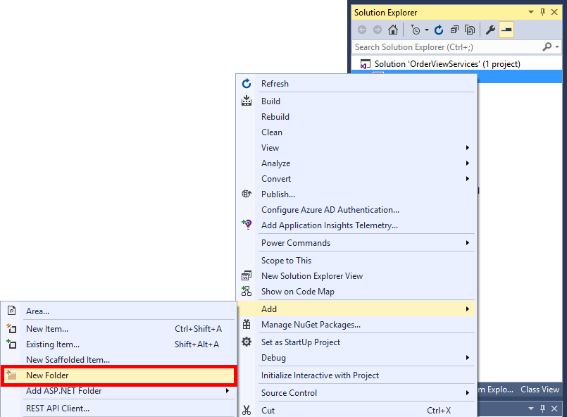

    _Adding a new folder_		 

1. Right-click over your new **Data** folder and select **Add > New Item**. 

1. In the "Add New Item" dialog select **Data > ADO.NET Entity Data Model**, and enter the value “OrdersModel” in the **Name** field.
 
    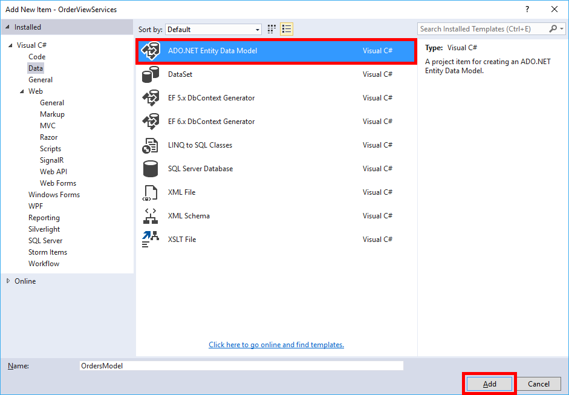

    _Adding the OrdersModel_		 

1. Click the **Add** button to view the Entity Data Model Wizard.

1. Select **EF Designer from database** and click **Next**. The "Connection" dialog will appear, prompting you to enter a database connection.
 
    

    _Selecting the EF Designer_		 

1. Click the **New Connection** button to view the "Connection Properties" dialog.
 
    

    _Selecting New Connection_		 

1. In the **Server** name box, enter the name of the Azure SQL Database server configured in Exercise 1, followed by “.database.windows.net” such as **traininglab01**.database.windows.net.
 
	>This will be the same server name value displayed in the SQL Server Object Explorer in the previous exercise.
	
1. Change the **Authentication type** to **SQL Server Authentication**, and enter "trainingadmin" in the **User name** box, as well as “Password_1” in the **Password** box. You will now be able to select a database.

1. Select **Northwind** in the **Select or enter a database name** list, and click **OK**. You will be redirected back to the original dialog and your connection string property will be displayed in the **Connection string** window.
 
    

    _Setting connection properties_	
	
1. Select **No, exclude sensitive data from the connection string. I will set it in my application code**. Selecting this option will remove any password information from your Web.config file. 

1. Click **Next** to proceed to the "Entity Framework version" dialog, Leave the default of Entity Framework 6.x and click **Next**.
 
    

    _Setting connection properties_	

    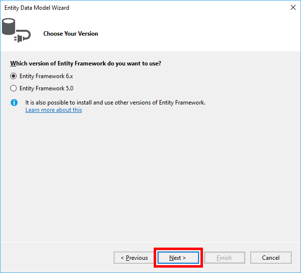

    _Setting the connection version_		
	
1. On the "Choose Your Database Objects and Settings" dialog, expand the **Tables** node and check the box labeled as **dbo**. This will select all the tables from your Northwind database for access through your Entity Framework model. 
 
1. Leave the remainder of the selections and settings as the defaults and click **Finish**. The Entity Framework Data Model Wizard will create all the data mappings necessary for accessing the data in your Northwind database.

    

    _Selecting all tables_			
	
	>Creation of mappings typically takes between 30 to 60 seconds. When mapping is complete, an OrdersModel.edmx file will appear in your primary Visual Studio pane.

    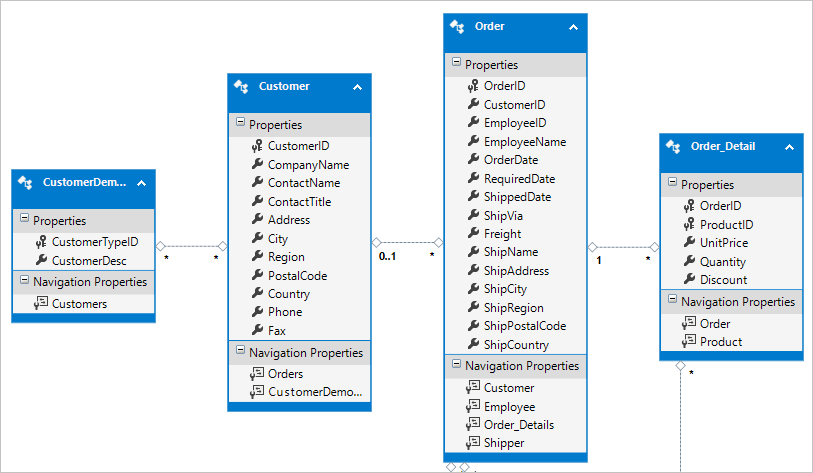

    _The newly created OrdersModel_			
	
Now you’re ready to start writing code to access the data models you created, to add data access logic:

1. In the Solution Explorer, right-click the **Models** folder and select **Add -> Class**.

1. Type "OrderInformation.cs" (without quotation marks) into the **Name** box, and then click **OK**.

    

    _Creating a new class file_			

    

    _Adding the OrderInformation class_				
	
1. Replace the empty OrderInformation class with the following class definitions, and note that you are making the class public rather than private:
 
    

    _The empty OrderInformation class_		
	
	```C#
	 public class OrderInformation
	    {
	        public int OrderId { get; set; }
	        public string CustomerId { get; set; }
	        public Nullable<int> EmployeeId { get; set; }
	        public string EmployeeName { get; set; }
	        public Nullable<System.DateTime> OrderDate { get; set; }
	        public Nullable<System.DateTime> RequiredDate { get; set; }
	        public Nullable<System.DateTime> ShippedDate { get; set; }
	        public Nullable<int> ShipVia { get; set; }
	        public Nullable<decimal> Freight { get; set; }
	        public string ShipName { get; set; }
	        public string ShipAddress { get; set; }
	        public string ShipCity { get; set; }
	        public string ShipRegion { get; set; }
	        public string ShipPostalCode { get; set; }
	        public string ShipCountry { get; set; }
	        public List<OrderDetailInformation> OrderDetails { get; set; }
	        public CustomerInformation Customer { get; set; }
	
	    }
	    public class CustomerInformation
	    {
	        public string CustomerId { get; set; }
	        public string CompanyName { get; set; }
	        public string ContactName { get; set; }
	        public string ContactTitle { get; set; }
	        public string Address { get; set; }
	        public string City { get; set; }
	        public string Region { get; set; }
	        public string PostalCode { get; set; }
	        public string Country { get; set; }
	        public string Phone { get; set; }
	        public string Fax { get; set; }
	    }
	
	    public class OrderDetailInformation
	    {
	        public int OrderId { get; set; }
	        public int ProductId { get; set; }
	        public decimal UnitPrice { get; set; }
	        public short Quantity { get; set; }
	        public float Discount { get; set; }
	
	        public ProductInformation Product { get; set; }
	    }
	
	    public class ProductInformation
	    {
	        public int ProductId { get; set; }
	        public string ProductName { get; set; }
	        public Nullable<int> SupplierId { get; set; }
	        public Nullable<int> CategoryId { get; set; }
	        public string QuantityPerUnit { get; set; }
	        public Nullable<decimal> UnitPrice { get; set; }
	        public Nullable<short> UnitsInStock { get; set; }
	        public Nullable<short> UnitsOnOrder { get; set; }
	        public Nullable<short> ReorderLevel { get; set; }
	        public bool Discontinued { get; set; }
	    }
	```	
	
	>These class definitions will provide the model for your customer, product, and order data.
 
	
1. In the Solution Explorer, right-click the **OrderViewServices** project and select **Add > New Folder** and name the new folder **Helpers**.
 
    

    _The new Helpers folder_		 

1. Right-click the new **Helpers** folder and select **Add -> Class**.

1. Type "OrderHelper.cs" (without quotation marks) into the **Name** box, and then click **OK**.
 
    

    _Adding the OrderHelper class_		 
 
1. Replace the entire contents of the class file with the following class definition, and note that you are making the class public rather than private, as well as marking the methods as static:

	```C#
	using OrderViewServices.Models;
	using System;
	using System.Collections.Generic;
	using System.Linq;
	using System.Web;
	
	namespace OrderViewServices.Helpers
	{
	    public static class OrderHelper
	    {
	        public static string CreateConnectionString()
	        {
	            string userName = (string)System.Web.HttpContext.Current.Cache["CurrentUser"];
	            string password = "Password_1";
	
	            if (string.IsNullOrEmpty(userName))
	            {
	                userName = "trainingadmin";
	                password = "Password_1";
	            }
	
	            return string.Format("data source=traininglabs01.database.windows.net;initial catalog=Northwind;user id={0};password={1};MultipleActiveResultSets=True;App=EntityFramework", userName, password);
	        }
	
	        public static List<OrderInformation> GetOrders()
	        {
	            List<OrderInformation> orders = new List<OrderInformation>();
	
	            using (Data.NorthwindEntities entities = new Data.NorthwindEntities())
	            {
	                entities.Database.Connection.ConnectionString = CreateConnectionString();
	                entities.Database.Connection.Open();
	
	                try
	                {
	
	                    foreach (var result in entities.Orders.OrderByDescending(o => o.OrderDate).Take(20))
	                    {
	                        orders.Add(result.ToOrderInformation());
	                    }
	
	                }
	                catch (System.Data.Entity.Infrastructure.DbUpdateException ex)
	                {
	
	                }
	                finally
	                {
	                    entities.Database.Connection.Close();
	                }
	
	                return orders;
	            }
	        }
	
	        public static OrderInformation GetOrder(int orderId)
	        {
	            OrderInformation order = null;
	
	            using (Data.NorthwindEntities entities = new Data.NorthwindEntities())
	            {
	                entities.Database.Connection.ConnectionString = CreateConnectionString();
	                entities.Database.Connection.Open();
	
	                try
	                {
	                    var result = entities.Orders.Where(w => w.OrderID == orderId).FirstOrDefault();
	
	                    if (result != null)
	                    {
	                        order = result.ToOrderInformation();
	                    }
	
	                }
	                catch (System.Data.Entity.Infrastructure.DbUpdateException ex)
	                {
	
	                }
	                finally
	                {
	                    entities.Database.Connection.Close();
	                }
	
	                return order;
	            }
	        }
	    }
	}
	```
	
	>NOTE These methods will be used to access order data from your data layer via the Entity Framework OrdersModel created earlier in this exercise.

1. Location the **CreateConnectionString** method at the top of the class and replace **“database_server_name”** with the name of your Azure SQL Database server created in Exercise 1, Step 10. 

    

    _Replacing the database name_	

	>Make sure you leave .database.windows.net value as it is, only replacing the **server name**.

1. In the Solution Explorer, right-click the **OrderViewServices** project and select **Add > New Folder** and name the new folder **Extensions**.

    

    _The new Extensions folder_	

1. Right-click the new **Extensions** folder and select **Add -> Class**.

1. Type "ListExtensions.cs" (without quotation marks) into the **Name** box, and then click **OK**.

    

    _Adding the ListExtensions class_	

1. Replace the entire contents of the class file with the following class definitions, and note that you are making the class public rather than private:

	```C#
	using OrderViewServices.Models;
	using System;
	using System.Collections.Generic;
	using System.Linq;
	using System.Web;
	
	namespace OrderViewServices
	{
	    public static class ListExtensions
	    {
	        public static OrderInformation ToOrderInformation(this Data.Order order)
	        {
	            return new OrderInformation()
	            {
	                Customer = order.Customer.ToCustomerInformation(),
	                OrderDetails = order.Order_Details.ToOrderDetailInformationList(),
	
	                CustomerId = order.CustomerID,
	                EmployeeId = order.EmployeeID,
	                EmployeeName = order.EmployeeName,
	                Freight = order.Freight,
	                OrderDate = order.OrderDate,
	                OrderId = order.OrderID,
	                RequiredDate = order.RequiredDate,
	                ShipAddress = order.ShipAddress,
	                ShipCity = order.ShipCity,
	                ShipCountry = order.ShipCountry,
	                ShipName = order.ShipName,
	                ShippedDate = order.ShippedDate,
	                ShipPostalCode = order.ShipPostalCode,
	                ShipRegion = order.ShipRegion,
	                ShipVia = order.ShipVia,
	            };
	        }
	
	        private static List<OrderDetailInformation> ToOrderDetailInformationList(this ICollection<Data.Order_Detail> orderDetails)
	        {
	            return (from detail in orderDetails select detail.ToOrderDetailInformation()).ToList();
	        }
	
	        public static OrderDetailInformation ToOrderDetailInformation(this Data.Order_Detail orderDetail)
	        {
	            return new OrderDetailInformation()
	            {
	                Discount = orderDetail.Discount,
	                OrderId = orderDetail.OrderID,
	                ProductId = orderDetail.ProductID,
	                Quantity = orderDetail.Quantity,
	                UnitPrice = orderDetail.UnitPrice,
	
	                Product = orderDetail.Product.ToProductInformation(),
	            };
	        }
	
	        public static CustomerInformation ToCustomerInformation(this Data.Customer customer)
	        {
	            return new CustomerInformation()
	            {
	                Address = customer.Address,
	                City = customer.City,
	                CompanyName = customer.CompanyName,
	                ContactName = customer.ContactName,
	                ContactTitle = customer.ContactTitle,
	                Country = customer.Country,
	                CustomerId = customer.CustomerID,
	                Fax = customer.Fax,
	                Phone = customer.Phone,
	                PostalCode = customer.PostalCode,
	                Region = customer.Region,
	
	            };
	        }
	
	        public static ProductInformation ToProductInformation(this Data.Product product)
	        {
	            return new ProductInformation()
	            {
	                CategoryId = product.CategoryID,
	                Discontinued = product.Discontinued,
	                ProductId = product.ProductID,
	                ProductName = product.ProductName,
	                QuantityPerUnit = product.QuantityPerUnit,
	                ReorderLevel = product.ReorderLevel,
	                SupplierId = product.SupplierID,
	                UnitPrice = product.UnitPrice,
	                UnitsInStock = product.UnitsInStock,
	                UnitsOnOrder = product.UnitsOnOrder,
	            };
	        }
	    }
	}
	```

1. In the Solution Explorer, right-click the **Controllers** folder and select **Add -> Controller**.

1. Select the** Web API 2 Controller – Empty** template and click **Add**, and then type "OrdersController" in the name box and click **Add**. A new API controller will be added to your project.
 
    

    _Adding a new controller_	
 
    

    _Adding the OrdersController_	

1. Add the following using statement to the top of the file:
	```C#
	using OrderViewServices.Models;
	```

1. Add the following API controller methods to the **OrdersController** class:
 
    

    _The empty OrdersController_	
 

```C#
  public IEnumerable<OrderInformation> GetOrders()
        {
            return Helpers.OrderHelper.GetOrders();
        }
         
        public OrderInformation Get(int id)
        {
            return Helpers.OrderHelper.GetOrder(id);
        }
               
        public IHttpActionResult Post(string value)
        {
            System.Web.HttpContext.Current.Cache["CurrentUser"] = value;

            return Created("CurrentUser", value);
        }
```

	> These API controller methods will provide REST-based methods for accessing order information from other apps and services.

All the code, classes, and models have now been written, and you can validate access to customer, product and order information to see the how data will be returned from your API App.

To validate access to your Azure SQL Database data:

1. Use Visual Studio's **Debug -> Start Without Debugging** command (or simply press **Ctrl+F5**) to launch the application in your browser. Here's how the application looks when an API method has not been specified:
 
    

    _No API methods specified screen_	

1. To retrieve a list of orders, append “/api/Orders” (without the quotation marks) to the end of the URL in your browser and hit the enter key on your keyboard. This will call the GetOrders method in your OrdersController class. Here’s how the output looks after calling the GetOrders method:
 
    

    _An API method specified_	

Up to now, you have been running the API app locally. Web Deploy makes it incredibly easy to publish to the Web without having to FTP up a bunch of files. You will be deploying the Azure API App to the Azure App Service that was created when you created the project in Visual Studio. (Remember that **Host in the cloud** box you checked? If not, refer to Step 4.)

1. Right-click the project in Solution Explorer and select **Publish...** from the context menu.

1. In the ensuing dialog, make sure **Web Deploy** is selected as the **Publish method**. Then click the **Publish** button.
 
    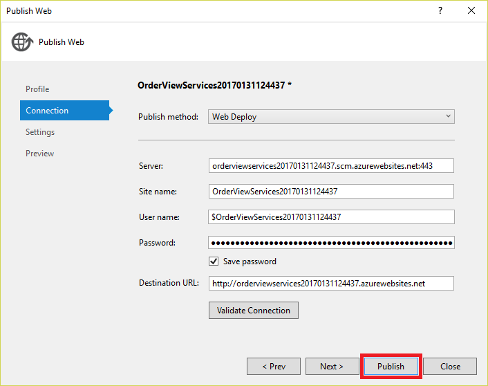

    _Publishing your API app_	
 
	>After a few moments, the app will appear in a browser window. Note the URL in the address bar. You will need this URL value for the next exercise. The app is no longer running locally; it's on the Web, where it's accessible by other apps and services.
 
    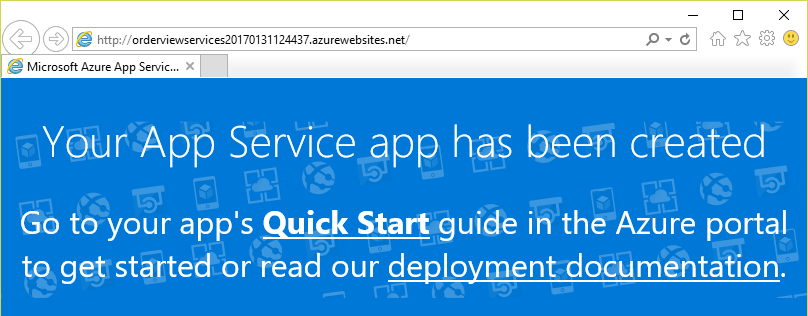

    _The published API app_	
 

In this exercise you’ve create a data access layer connected to your Azure SQL Database, and written code to retrieve customer, product, and order records encapsulated within REST-based API methods. You’ve also published the API methods to an App Service in Azure for use by other apps and services. The next step in to create a Windows Store app to access your Azure SQL Database API services.

<a name="Exercise4"></a>
## Exercise 4: Build an API-aware Windows Store app ##

The whole reason for creating and deploying your Azure SQL Database API App is so you can build smart apps that can interact with the data in your Azure SQL Database. There are a variety of ways to build such apps. You could call the service from a Web app using JavaScript and AJAX, for example, or you could use Visual Studio to write a Xamarin app that runs on iOS, Android, and Windows and places calls to the service using .NET's HttpClient class.

In this exercise, you will write a client app that targets the Universal Windows Platform, or UWP. The beauty of such apps is that they run on a variety of Windows devices, including PCs, tablets, phones, and even on Xbox One. The app you will write enables you to access orders for a specific salesperson as well as viewing order and customer details.

To create a Windows Store app:

1. In order to build and run UWP apps on a Windows 10 PC, you must enable developer mode on the device. To ensure that developer mode is enabled, click the **Windows** button (also known as the Start button) in the lower-left corner of the desktop. Then select **Settings** from the menu and click **Update & security** in the **Settings** dialog. Now click **For developers** on the left and select **Developer mode** on the right, as shown below.
 
    

    _Enabling developer mode_	
 
1. In Visual Studio, right-click over the **OrderViewServices solution** and select **Add > New Project** to create a new **Blank App (Universal Windows)** project named "OrderView."

	>Ensure you right-click over the **solution** and not the project in this step.
 
    

    _Adding a new UWP project_	
 
1. Click **OK** to accept the default target version and minimum version. A new UWP app names OrderView will be added to your OrderViewServices solution.
 
    

    _Setting the target versions_ 
 
    

    _Adding a new UWP project_	
 
1. In the Solution Explorer, right-click the new **OrderView** project and select **Set as startup project**.
 
    

    _Setting the startup project_ 
 
1. Again, in the Solution Explorer, right-click over the **OrderView** project and select **Deploy**. This will deploy your app to the local computer and is required prior to running an application when it’s part of a mixed-platform solution.
 
    

    _Deploying the project_ 
 
1. Now use Visual Studio's **Debug -> Start Without Debugging** command (or simply press **Ctrl+F5**) to launch the application on your computer. Here's how the application looks in its present state:
 
    

    _The blank OrderView app_  

The shell for your application has been created successfully, now it’s time to write code to access the Azure SQL Database API methods created in the previous exercise, and add user interface elements to visualize the data. 

1. In the Solution Explorer, right-click the **OrderView** project and select **Add > New Folder** and name the new folder **Common**.
 
    

    _The new Common folder_  

1. Right-click the new **Common** folder and select **Add -> Class**.

1. Type "BindableBase.cs" (without quotation marks) into the **Name** box, and then click **OK**.
 
    

    _Adding the BindableBase class_  

1. Replace the entire contents of the class file with the following code:

	```C#
	using System;
	using System.ComponentModel;
	using System.Runtime.CompilerServices;	
	
	namespace OrderView.Common
	{
	    /// <summary>
	    /// Implementation of <see cref="INotifyPropertyChanged"/> to simplify models.
	    /// </summary>
	
	    public abstract class BindableBase : INotifyPropertyChanged
	    {
	        /// <summary>
	        /// Multicast event for property change notifications.
	        /// </summary>
	        public event PropertyChangedEventHandler PropertyChanged;
	
	        /// <summary>
	        /// Checks if a property already matches a desired value.  Sets the property and
	        /// notifies listeners only when necessary.
	        /// </summary>
	        /// <typeparam name="T">Type of the property.</typeparam>
	        /// <param name="storage">Reference to a property with both getter and setter.</param>
	        /// <param name="value">Desired value for the property.</param>
	        /// <param name="propertyName">Name of the property used to notify listeners.  This
	        /// value is optional and can be provided automatically when invoked from compilers that
	        /// support CallerMemberName.</param>
	        /// <returns>True if the value was changed, false if the existing value matched the
	        /// desired value.</returns>
	        protected bool SetProperty<T>(ref T storage, T value, [CallerMemberName] String propertyName = null)
	        {
	            if (object.Equals(storage, value)) return false;
	
	            storage = value;
	            this.OnPropertyChanged(propertyName);
	            return true;
	        }
	
	        /// <summary>
	        /// Notifies listeners that a property value has changed.
	        /// </summary>
	        /// <param name="propertyName">Name of the property used to notify listeners.  This
	        /// value is optional and can be provided automatically when invoked from compilers
	        /// that support <see cref="CallerMemberNameAttribute"/>.</param>
	        protected void OnPropertyChanged([CallerMemberName] string propertyName = null)
	        {
	            var eventHandler = this.PropertyChanged;
	            if (eventHandler != null)
	            {
	                eventHandler(this, new PropertyChangedEventArgs(propertyName));
	            }
	        }
	    }
	}

	```

1. In the Solution Explorer, right-click the **OrderView** project and select **Add > New Folder** and name the new folder **Models**.
 
    

    _Adding the Models folder_  

1. Right-click the new **Models** folder and select **Add -> Class**.

1. Type "OrderInformation.cs" (without quotation marks) into the **Name** box, and then click **OK**.
 
    

    _Adding the OrderInformation class_  

1. Replace the empty **OrderInformation** class with the following class definitions, and note that you are making the class public rather than private:
 
    

    _The empty OrderInformation class_  

	```C#
  
	public class SalespersonInformation
    {
        public string Label { get; set; }
        public string UserName { get; set; }
    }
    public class ProductInformation
    {
        public int ProductId { get; set; }
        public string ProductName { get; set; }
        public Nullable<int> SupplierId { get; set; }
        public Nullable<int> CategoryId { get; set; }
        public string QuantityPerUnit { get; set; }
        public Nullable<decimal> UnitPrice { get; set; }
        public Nullable<short> UnitsInStock { get; set; }
        public Nullable<short> UnitsOnOrder { get; set; }
        public Nullable<short> ReorderLevel { get; set; }
        public bool Discontinued { get; set; }
    }

    public class SuggestionInformation
    {
        public string odatacontext { get; set; }
        public Value[] value { get; set; }
    }

    public class Value
    {
        public float searchscore { get; set; }
        public string CustomerID { get; set; }
        public string CompanyName { get; set; }
    }

    public class CustomerInformation
    {
        public string CustomerId { get; set; }
        public string CompanyName { get; set; }
        public string ContactName { get; set; }
        public string ContactTitle { get; set; }
        public string Address { get; set; }
        public string City { get; set; }
        public string Region { get; set; }
        public string PostalCode { get; set; }
        public string Country { get; set; }
        public string Phone { get; set; }
        public string Fax { get; set; }
    }
    public class OrderInformation
    {
        public int OrderId { get; set; }
        public string CustomerId { get; set; }
        public Nullable<int> EmployeeId { get; set; }
        public string EmployeeName { get; set; }
        public Nullable<System.DateTime> OrderDate { get; set; }
        public Nullable<System.DateTime> RequiredDate { get; set; }
        public Nullable<System.DateTime> ShippedDate { get; set; }
        public Nullable<int> ShipVia { get; set; }
        public Nullable<decimal> Freight { get; set; }
        public string ShipName { get; set; }
        public string ShipAddress { get; set; }
        public string ShipCity { get; set; }
        public string ShipRegion { get; set; }
        public string ShipPostalCode { get; set; }
        public string ShipCountry { get; set; }
        public List<OrderDetailInformation> OrderDetails { get; set; }
        public CustomerInformation Customer { get; set; }

    }

    public class OrderDetailInformation
    {
        public int OrderId { get; set; }
        public int ProductId { get; set; }
        public decimal UnitPrice { get; set; }
        public short Quantity { get; set; }
        public float Discount { get; set; }

        public ProductInformation Product { get; set; }
    }
	```

	>Just as in the previous exercise, these class definitions will provide the model for your customer, product, and order data.

1. Right-click once more over the **Models** folder and select **Add -> Class**.

1. Type "MainViewModel.cs" (without quotation marks) into the **Name** box, and then click **OK**.
 
    

    _Adding the MainViewModel class_  

1. Replace the empty **MainViewModel** class with the following class definitions, and note that you are implementing the BindableBase class created earlier:

	```C#
	using System;
	using System.Collections.Generic;
	using System.Collections.ObjectModel;
	using System.Linq;
	using System.Text;
	using System.Threading.Tasks;
	using OrderView.Models;
	
	namespace OrderView.Models
	{
	    public class MainViewModel : Common.BindableBase
	    {
	        private ObservableCollection<OrderInformation> _currentOrders;
	        public ObservableCollection<OrderInformation> CurrentOrders
	        {
	            get { return this._currentOrders; }
	            set { this.SetProperty(ref this._currentOrders, value); }
	        }
	
	        private List<SalespersonInformation> _salespersons;
	        public List<SalespersonInformation> Salespersons
	        {
	            get { return this._salespersons; }
	            set { this.SetProperty(ref this._salespersons, value); }
	        }
	
	        private SalespersonInformation _selectedSalesperson;
	        public SalespersonInformation SelectedSalesperson
	        {
	            get { return this._selectedSalesperson; }
	            set { this.SetProperty(ref this._selectedSalesperson, value); }
	        }
	
	
	        private ObservableCollection<string> _searchSuggestions;
	        public ObservableCollection<string> SearchSuggestions
	        {
	            get { return this._searchSuggestions; }
	            set { this.SetProperty(ref this._searchSuggestions, value); }
	        }
	
	        private bool _isLoading;
	
	        public bool IsLoading
	        {
	            get { return this._isLoading; }
	            set { this.SetProperty(ref this._isLoading, value); }
	        }
	
	        public const string OrderApiUrl = "";
	
	        public void Initialize()
	        {
	            this.CurrentOrders = new ObservableCollection<OrderInformation>();
	            this.SearchSuggestions = new ObservableCollection<string>();
	            this.Salespersons = Helpers.OrderHelper.GetSalespersons();
	
	            this.SelectedSalesperson = this.Salespersons.FirstOrDefault();	
	        }
	 
	        public void FilterByCustomer(string selectedCustomer)
	        {
	            LoadOrdersAsync(selectedCustomer);
	        }
	
	
	        public void ChangeUser(SalespersonInformation salesperson)
	        {
	            this.SelectedSalesperson = salesperson;
	
	            LoadOrdersAsync();
	        }
	
	        public async void LoadOrdersAsync(string filter)
	        {
	            this.IsLoading = true;
	
	            await Helpers.OrderHelper.SetUserAsync(this.SelectedSalesperson.UserName);
	
	            this.CurrentOrders.Clear();
	
	            var orders = await Helpers.OrderHelper.GetOrdersAsync(filter);
	
	            foreach (var order in orders)
	            {
	                this.CurrentOrders.Add(order);
	            }
	
	            this.IsLoading = false;
	
	        }
	
	        public async void LoadOrdersAsync()
	        {
	            this.IsLoading = true;
	
	            await Helpers.OrderHelper.SetUserAsync(this.SelectedSalesperson.UserName);
	
	            this.CurrentOrders.Clear();
	
	            var orders = await Helpers.OrderHelper.GetOrdersAsync();
	
	            foreach (var order in orders)
	            {
	                this.CurrentOrders.Add(order);
	            }
	
	            this.IsLoading = false;
	
	        }
	    }
	}
	```

1. In the Solution Explorer, right-click the **OrderView** project and select **Add > New Folder** and name the new folder **Helpers**.
 
    

    _The new Helpers folder_  

1. Right-click the new **Helpers** folder and select **Add -> Class**.

1. Type "OrderHelper.cs" (without quotation marks) into the **Name** box, and then click **OK**.
 
    

    _Creating the OrderHelper class_  

1. Replace the entire contents of the class file with the following class definition, and note that you are making the class public rather than private, as well as marking the methods as static:

	```C#
	using OrderView.Models;
	using System;
	using System.Collections.Generic;
	using System.Linq;
	using System.Net.Http;
	using System.Runtime.Serialization.Json;
	using System.Text;
	using System.Threading.Tasks;
	
	namespace OrderView.Helpers
	{
	    public static class OrderHelper
	    {
	        public const string OrderApiUrl = "order_api_url";
	
	        public static List<SalespersonInformation> GetSalespersons()
	        {
	            List<SalespersonInformation> salespersons = new List<SalespersonInformation>();
	
	            salespersons.Add(new SalespersonInformation() { Label = "Janet (Sales Manager)", UserName = "Janet" });
	            salespersons.Add(new SalespersonInformation() { Label = "Andrew (Salesperson)", UserName = "Andrew" });
	            salespersons.Add(new SalespersonInformation() { Label = "Nancy (Salesperson)", UserName = "Nancy" });
	
	            return salespersons;
	        }
	
	        public static async Task<List<OrderInformation>> GetOrdersAsync(string filter)
	        {
	            List<OrderInformation> orders = new List<OrderInformation>();
	
	            Uri requestUri = new Uri(OrderApiUrl + "/api/Orders");
	            HttpClient client = new System.Net.Http.HttpClient();
	            HttpResponseMessage response = await client.GetAsync(requestUri);
	
	            var stream = await response.Content.ReadAsStreamAsync();
	            stream.Position = 0;
	
	            var settings = new DataContractJsonSerializerSettings { DateTimeFormat = new System.Runtime.Serialization.DateTimeFormat("yyyy-MM-dd'T'HH:mm:ss") };
	
	            DataContractJsonSerializer ser = new DataContractJsonSerializer(typeof(List<OrderInformation>), settings);
	            orders = (List<OrderInformation>)ser.ReadObject(stream);
	
	            return orders.Where(w => w.Customer.CompanyName.Equals(filter)).ToList();
	        }
	
	        public static async Task<List<OrderInformation>> GetOrdersAsync()
	        {
	            List<OrderInformation> orders = new List<OrderInformation>();
	
	            Uri requestUri = new Uri(OrderApiUrl + "api/Orders");
	            HttpClient client = new System.Net.Http.HttpClient();
	            HttpResponseMessage response = await client.GetAsync(requestUri);
	
	            var stream = await response.Content.ReadAsStreamAsync();
	            stream.Position = 0;
	
	            var settings = new DataContractJsonSerializerSettings { DateTimeFormat = new System.Runtime.Serialization.DateTimeFormat("yyyy-MM-dd'T'HH:mm:ss") };
	
	            DataContractJsonSerializer ser = new DataContractJsonSerializer(typeof(List<OrderInformation>), settings);
	            orders = (List<OrderInformation>)ser.ReadObject(stream);
	
	            return orders;
	        }
	
	        public static async Task<bool> SetUserAsync(string userName)
	        {
	            Uri requestUri = new Uri(OrderApiUrl + $"/api/Orders?value={userName}");
	
	            var client = new System.Net.Http.HttpClient();
	            HttpResponseMessage respon = await client.PostAsync(requestUri, null);
	
	            return respon.IsSuccessStatusCode;
	        }
	    }
	}
	```
 
	>These methods will be used to access the API methods created earlier in the previous exercise.

1. Locate the **OrderViewApi** property at the top of the class definition and replace **“order_api_url”** highlighted below with the **URL** value of your Azure API App from the last step in Exercise 3.
 
    

    _Replacing the order_api_url value_  

1. Open MainPage.xaml and find the empty Grid element highlighted below.
 
    

    _The empty Grid element_  

1. Replace the empty Grid with the following markup:

	```C#
	<Page.Resources>
        <Style x:Key="SmallerLabelStyle" TargetType="TextBlock">
            <Setter Property="FontSize" Value="12"/>
            <Setter Property="FontWeight" Value="Light"/>
        </Style>
    </Page.Resources>

    <Grid Background="{ThemeResource ApplicationPageBackgroundThemeBrush}">
        <Grid.RowDefinitions>
            <RowDefinition Height="Auto"/>
            <RowDefinition/>
        </Grid.RowDefinitions>

        <ComboBox VerticalAlignment="Center" HorizontalAlignment="Left" ItemsSource="{Binding Salespersons}" SelectedItem="{Binding SelectedSalesperson, Mode=TwoWay}" SelectionChanged="OnEmployeeChanged" Width="240" Margin="40,40,40,0">
            <ComboBox.Header>
                <TextBlock Margin="0,0,0,-5" FontSize="12" FontWeight="Light" Text="SELECT SALESPERSON"/>
            </ComboBox.Header>
            <ComboBox.ItemTemplate>
                <DataTemplate>
                    <TextBlock FontWeight="Light" Text="{Binding Label}" />
                </DataTemplate>
            </ComboBox.ItemTemplate>
        </ComboBox>
 
        <ScrollViewer Grid.Row="1" Margin="40">

            <GridView ItemsSource="{Binding CurrentOrders}">
                <GridView.ItemTemplate>
                    <DataTemplate>
                        <Grid Margin="10" Width="300" Tapped="OnShowCustomer">
                            <FlyoutBase.AttachedFlyout>
                                <Flyout Placement="Top" >
                                    <Grid>
                                        <StackPanel Margin="10">
                                            <TextBlock FontWeight="SemiBold" Text="{Binding Customer.CompanyName}" />
                                            <TextBlock Style="{StaticResource SmallerLabelStyle}" Text="{Binding Customer.Address}" />
                                            <TextBlock Style="{StaticResource SmallerLabelStyle}" Text="{Binding Customer.City}" />
                                            <TextBlock Style="{StaticResource SmallerLabelStyle}" Text="{Binding Customer.PostalCode}" />
                                            <TextBlock Style="{StaticResource SmallerLabelStyle}" Text="{Binding Customer.Country}" />
                                            <TextBlock Style="{StaticResource SmallerLabelStyle}" Text="{Binding Customer.Phone}" />
                                            <TextBlock Style="{StaticResource SmallerLabelStyle}" Text="{Binding Customer.Fax}" />
                                        </StackPanel>
                                    </Grid>
                                </Flyout>
                            </FlyoutBase.AttachedFlyout>

                            <Grid.ColumnDefinitions>
                                <ColumnDefinition Width="Auto"/>
                                <ColumnDefinition />
                            </Grid.ColumnDefinitions>

                            <TextBlock Margin="0,0,10,0" VerticalAlignment="Top" HorizontalAlignment="Left" FontSize="36" Text="" FontFamily="{ThemeResource SymbolThemeFontFamily}"/>

                            <StackPanel Grid.Column="1">

                                <TextBlock Style="{ThemeResource CaptionTextBlockStyle}" Text="CUSTOMER"/>
                                <TextBlock FontWeight="SemiBold" Text="{Binding Customer.CompanyName}"/>

                                <TextBlock Margin="0,10,0,0" Style="{ThemeResource CaptionTextBlockStyle}" Text="SALESPERSON"/>
                                <TextBlock FontWeight="SemiBold" Text="{Binding EmployeeName}"/>

                                <TextBlock Margin="0,10,0,0" Style="{ThemeResource CaptionTextBlockStyle}" Text="ORDER NO"/>
                                <TextBlock FontWeight="SemiBold" Text="{Binding OrderId}"/>

                                <TextBlock Margin="0,10,0,0" Style="{ThemeResource CaptionTextBlockStyle}" Text="ORDER DATE"/>
                                <TextBlock FontWeight="SemiBold" Text="{Binding OrderDate}"/>

                                <TextBlock Margin="0,10,0,0" Style="{ThemeResource CaptionTextBlockStyle}">
                            <Run Text="TOTAL ITEMS"/>
                            <Run FontWeight="SemiBold" Text="{Binding OrderDetails.Count}"/>
                                </TextBlock>

                            </StackPanel>

                        </Grid>
                    </DataTemplate>
                </GridView.ItemTemplate>
                <GridView.ItemsPanel>
                    <ItemsPanelTemplate>
                        <ItemsWrapGrid Orientation="Horizontal"/>
                    </ItemsPanelTemplate>
                </GridView.ItemsPanel>
            </GridView>
        </ScrollViewer>

        <ProgressRing Grid.Row="1" VerticalAlignment="Center" HorizontalAlignment="Center" Width="160" Height="160" IsActive="{Binding IsLoading}" IsEnabled="{Binding IsLoading}"/>

    </Grid>
	```
	>The markup that you just inserted is Extensible Application Markup Language, or XAML. XAML is a language created by Microsoft for building user interfaces. It was originally created for WPF, but has since been repurposed for universal Windows apps. Combined with Xamarin Forms, it can even be used to build user interfaces for iOS and Android. It is an extremely expressive language that enjoys designer support in Visual Studio and other popular tools.

1. Now open MainPage.xaml.cs and add the following using statement to those already at the top of the page:

	```C#
	using OrderView.Models;
	```

1. Still in MainPage.xaml.cs, replace everything inside the **MainPage** class with the following code:

	```C#
	MainViewModel ViewModel = new MainViewModel();

    public MainPage()
    {
        this.InitializeComponent();
        this.Loaded += MainPage_Loaded;
    }

    private void MainPage_Loaded(object sender, RoutedEventArgs e)
    {
        this.ViewModel.Initialize();

        this.DataContext = this.ViewModel;
    }	

    private void OnEmployeeChanged(object sender, SelectionChangedEventArgs e)
    {
        if (this.ViewModel.SelectedSalesperson != null) this.ViewModel.ChangeUser(this.ViewModel.SelectedSalesperson);
    }	 

    private void OnShowCustomer(object sender, TappedRoutedEventArgs e)
    {
        FlyoutBase.ShowAttachedFlyout(sender as FrameworkElement);	
    }

    private void OnSuggestionChosen(AutoSuggestBox sender, AutoSuggestBoxSuggestionChosenEventArgs args)
    {
        this.ViewModel.FilterByCustomer((string)args.SelectedItem);
    }
	```

1. In the Solution Explorer, right-click over the **OrderView** project and select **Deploy**. This will deploy your app to the local computer and is required prior to running an application when it’s part of a mixed-platform solution.
 
    

    _Deploying the project_ 

1. Now use Visual Studio's **Debug -> Start Without Debugging** command (or simply press **Ctrl+F5**) to launch the application on your computer. Here's how the application looks in its completed state:
 
    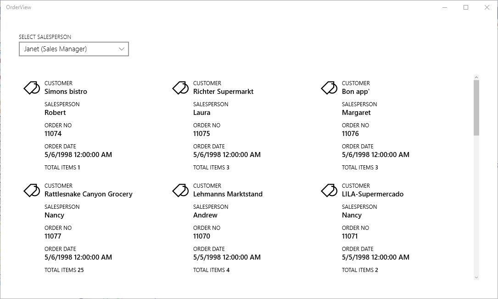

    _Running the completed UWP app_ 

When you populated your Azure SQL Database in Exercise 2, three (3) users were created: Janet, Andrew, and Nancy. Janet is a Sales Manager and should have permission to view all orders, however Andrew and Nancy are Salespersons, and should only be able to view orders they created. The current state of your OrderView app shows all orders regardless of which user is using the app. To simulate viewing orders, the app contains a selection dropdown control to view orders “AS” a specific user. Review how the list of orders being returned does not change when you select a different salesperson. 

To limit as Salesperson’s ability to view only their orders, we can take advantage of Azure SQL Database **row-level security**.

There is also information in each customer record that should be “private” and not available for viewing through your app. In this scenario customer phone numbers should be “hidden” from users, however we don’t want to add the complexity into our code to “check and filter” the labels based on a user’s role. Instead we can implement Azure SQL Database **dynamic data masking** to mask these values in our application.

In the next exercise you will add row-level security and dynamic data masking to your Azure SQL Database to make sure Salesperson are only able to view the records and fields allowed in the requirements.

<a name="Exercise5"></a>
## Exercise 5: Manage record permissions and masks ##

In this exercise add row-level security and dynamic data masking to your Azure SQL Database to ensure Salesperson are only able to see the orders allowed by their organizational role (such as Sales Manager or Salesperson) as well as hiding the phone numbers for all customers.

To add row-level security to your Azure SQL Database:

1. In Visual Studio 2015, navigate to the **SQL Server Object Explorer**, and expand the server node to view the **Northwind** database.
 
    

    _Expanding the server node to the Northwind database_ 

1.  Right-click over the **Northwind** database and select **New Query…**.
  
     

    _Selecting the New Query command_		

1. From the Visual Studio menu select **Edit > Insert File as Text** and browse to the **Resources > Scripts** folder included with this lab.
 
    

    _Selecting the Insert File as Text command_	

1. Select the **Apply NORTHWIND security.sql** script and click **Open**.
 
    

    _Opening the Apply NORTHWIND security script_	

1. When the script loads in the main Visual Studio pane, right-click over **any area in the script** and select **Execute**.
 
    

    _Executing the Apply NORTHWIND security script_	
	
	>This script will execute and add row-level security to the Orders table. When the script has completed executing a Query completed message will appear at the bottom of the query windows. Row-level security has now been added to your database. 
	
	

    _Query executed succesfully message_

Now let’s make sure customer phone numbers are hidden from users accessing your Azure SQL Database.	

To add dynamic data masking to your Azure SQL Database we need to go back to the Azure Portal:

1. Open the Azure Management Portal, if asked to login, do so with your Microsoft Account.

1. Click the **“hamburger”** icon in the Azure Portal to open the side drawer.

1. Click **Resource Groups** followed by **TrainingLabResources**.

1. Click the **Northwind** database created in Exercise 1 to view database properties.	
 
	

    _Selecting the Northwind database_

1. In the **Northwind** database properties **SETTINGS** section, select **Dynamic data masking** to open the **Dynamic data masking** panel.
 
	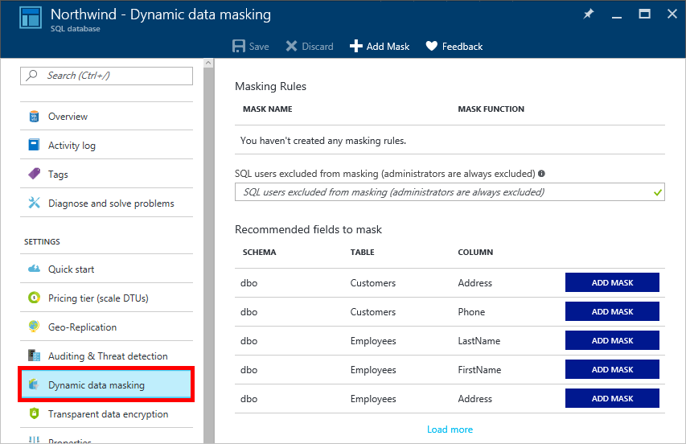

    _Opening the Dynamic data masking panel_

1. In the **Masking rules panel**, locate the **Customers | Phone** masking recommendation and click the **Add Mask** button. A new mask named dbo_Customers_Phone has been created for customer phone number, with a default mask as 0, xxxx, 01-01-1900. 
 
	

    _Adding the customer phone mask_
 
	This mask would meet the requirements; however, it gives the impression this value contains a date. Let’s change the mask to something more appropriate.

1. Click the new **dbo_Customers_Phone** mask to open the **Edit Masking Rule** panel.

1. Select **Custom string** from the **Masking field format** selection list, and then enter "xxxxxxx" (without the quotation marks) in the **Padding String** box.

1. Click **Update** in the **Edit Masking Rule** menu, and the **Save** in the** Dynamic data masking** panel. Dynamic data masking has now been added to your Azure SQL Database.
 
	

    _Updating the customer phone mask_ 
 
	

    _Saving Dynamic data mask changes_ 

To view and verify row-level security and dynamic data masking, let’s go back to the OrderView app and review how orders are returned when we select different Salespersons. 

1. Use Visual Studio's **Debug -> Start Without Debugging** command (or simply press **Ctrl+F5**) to launch the application on your computer.

1. When the app loads, notice how the selected salesperson (Janet, as Sales Manager) is able to view records from multiple employees.
 
	

    _Viewing Sales Manager row-level security in the app_
 
1. Now select **Andrew** from the **SELECT SALESPERSON** drop down and review how only orders created by Andrew are available for review.
 
	

    _Viewing Salesperson row-level security in the app_
 
1. To verify dynamic data masking, tap a **CUSTOMER NAME** label for any order. A small window will open with customer details, including a customer’s phone and fax number. A customer’s phone number is not available for viewing, but is instead “masked” as the value entered in Step 8 (“xxxxxx’).
 
	

    _Viewing a masked customer phone number_ 

Notice how you didn’t need to make any changes to your data access layer (you’re Azure API App) in order to limit the information available to salespersons. A few simple scripts or settings in the database itself were enough to create these types of security features.

You’ve now create an Azure SQL Database, written and deployed an Azure API app to serve as the data access layer, and created a simple UWP app to view orders based on a selected salesperson. 

<a name="Summary"></a>
## Summary ##

In this hands-on lab you learned how to:

- Create an Azure SQL Database
- Populate an Azure SQL Database with records
- Access Azure SQL records from your apps
- Filter and mask records based on user permissions

This is just a beginning, as there’s a whole lot more you can do to leverage the power of Azure SQL Database. Start experimenting with other Azure SQL Database features, especially dynamic data masking and geo-replication, as well as creating stored procedures, user-defined functions, and identifying other ways you can enhance your data strategies through the integration of Azure SQL Database into your application ecosystems.

----

Copyright 2016 Microsoft Corporation. All rights reserved. Except where otherwise noted, these materials are licensed under the terms of the MIT License. You may use them according to the license as is most appropriate for your project. The terms of this license can be found at https://opensource.org/licenses/MIT.