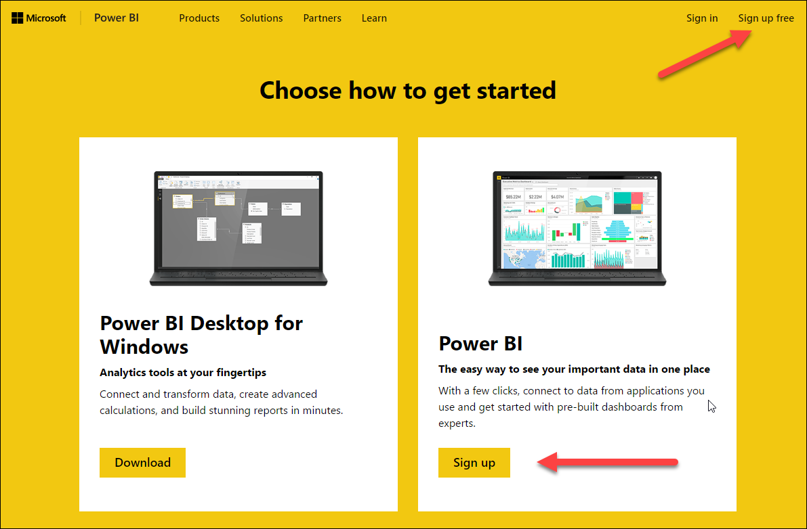
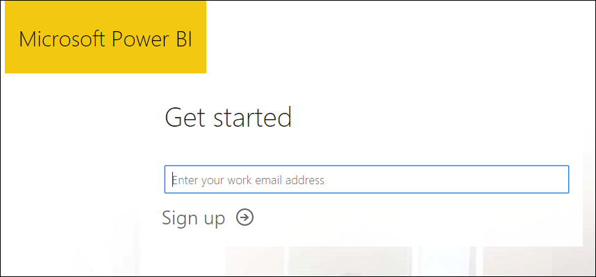
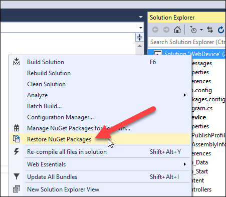
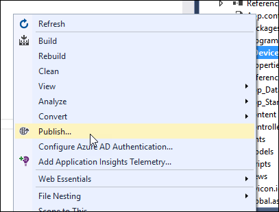
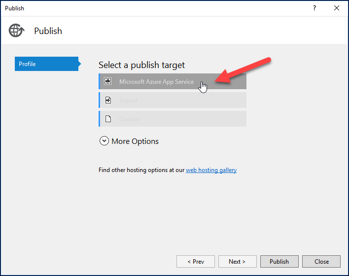
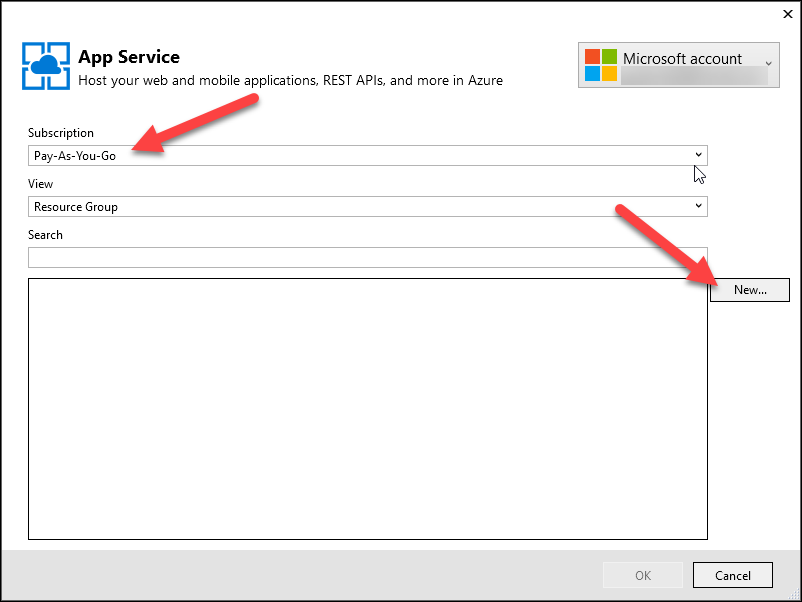
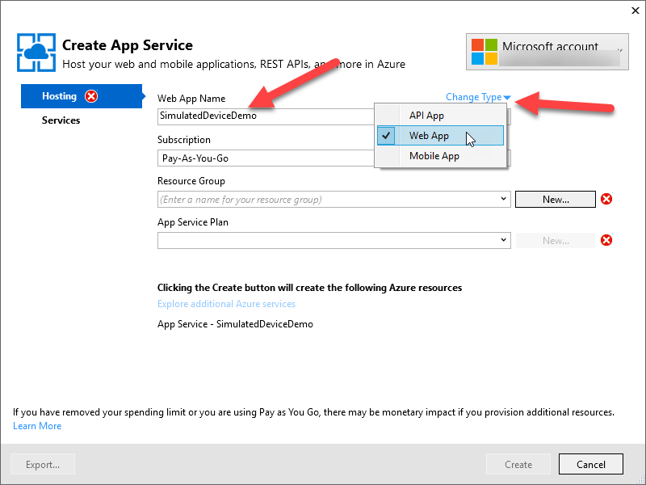

Objective
=========

The goal is to demonstrate an IoT solution in action (that uses Azure IoT Hub, Stream Analytics & PowerBI) and that even smartphones can be IoT devices. You’ll have the audience point their smartphone browsers to a Web page, have them send telemetry to the cloud and WOW them with live data being displayed in charts.

During this demo, there’s no need to show under the hood, understand the code or explain how the solution is built.

Duration
========

This demo should take about 10 minutes.

Requirements/Setup
==================

You must follow the Setup 1 instructions before doing the demo.

DEMO
====

Explain to the attendees that they’ll use their smartphone as simulated devices that will send some fake telemetry to a cloud backend and the data will be displayed in charts live.

Before beginning your presentation:

1.  Point your browser to the Azure portal: <http://portal.azure.com>

2.  Log in

3.  In a new tab, point to http://www.powerbi.com

4.  Login

5.  In a new tab, display the demo Web App

Let’s start the demo:

1.  Show demo Web app.

2.  Give the URL to the attendees.

    {width="6.5in" height="3.120138888888889in"}

3.  Ask them to click on the Go to Demo 1 button.

4.  Explain that the page will send to the cloud backend the number that they will select using the slider, and that, every two seconds.

5.  Ask them to click on the toggle button and move the slider from time to time.

    {width="6.5in" height="3.6875in"}

6.  Show the Power BI dashboard and explain that the data is displayed in almost real time.

    {width="6.5in" height="3.595138888888889in"}

7.  Show the IoT Hub in the Azure Portal.

8.  Explain that the messages are sent to an IoT messaging service called Azure IoT Hub that can process thousands of messages per second.

9.  Show the Stream Analytics job.

10. Show the query.

11. Explain that the query runs every 2 seconds and average the values sent by each device.

12. Explain that the query outputs the results to Power BI directly.

<!-- -->

1.  Create a new graph. Click on the SimulatedDevice Dataset.

2.  Select the line graph, drag the outtime field as the Axis, drag the avgtelemetry field as the Value and select Average from it’s dropdown menu.

    {width="3.822438757655293in" height="5.645127952755906in"}

3.  Drag the deviceid field as the Page level filter and select one of the device.

    {width="1.6768733595800525in" height="2.4580260279965005in"}

4.  If the device you’re looking for is not listed, select Advanced filtering, contains and the device name. Click Apply filter.

    {width="1.781026902887139in" height="3.499562554680665in"}

5.  Save and pin the report to the dashboard.

6.  Ask the attendee you have this device to change the value from time to time.

    {width="6.5in" height="4.720833333333333in"}

7.  This concludes the demo.

Teardown
========

You’ll be reusing the same services in multiple demos for this session so don’t delete them yet. See Teardown 1 when you have finished the session.
