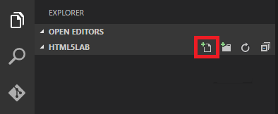
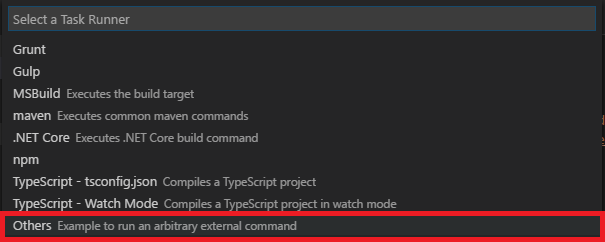
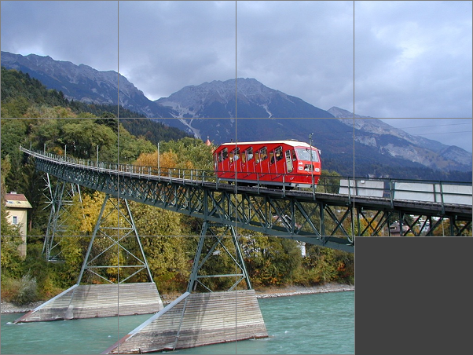
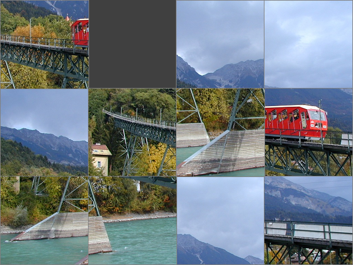

<a name="HOLTitle"></a>
# Using the HTML5 Canvas API to Build Rich Web Apps #

---

<a name="Overview"></a>
## Overview ##

HTML5 is the newest version of HTML, and is the basis for numerous rich and interactive Web pages as well as cross-platform mobile apps. More than just a markup language, HTML5 exposes a set of APIs that can be called from within a browser to draw onto a Web page, store data locally, get the user's current location, establish 2-way connections between browsers and Web servers, read the contents of files, play audio and video, and much more. HTML5 is constantly evolving by adding new features and APIs, and browser vendors such as Google and Microsoft are constantly updating their browsers to support the latest and greatest features of the platform.

One of the most compelling features of HTML5 is the [Canvas API](http://www.w3.org/TR/2dcontext/), which allows JavaScript code to draw directly into a browser window. To use the Canvas API, you begin by declaring one or more \<canvas\> elements in a page. Then you write code that retrieves a rendering context for a canvas, and call functions on the rendering context to draw pixels, lines, shapes, images, text, drop shadows, gradients, and more. The chart below was drawn entirely with the Canvas API, and uses just a few of the many functions that are available.


_Chart drawn with the HTML5 Canvas API_

In this lab, you will create a Web page that combines the HTML5 Canvas API with jQuery to display an interactive puzzle — one in which an image is programmatically divided into squares and the user is invited to scramble the image (and later unscramble it) by clicking individual squares. It is just one example of the kinds of interfaces you can build with the Canvas API. And it's a great place to start if you are new to HTML5 and are curious about why it is receiving so much mindshare. 

<a name="Objectives"></a>
### Objectives ###

In this hands-on lab, you will learn how to:

- Create and configure an HTML5 project in Visual Studio Code
- Use the HTML5 Canvas API to subdivide an image into pieces
- Draw an image (or part of an image) onto an HTML5 canvas
- Manipulate HTML5 canvases with jQuery

<a name="Prerequisites"></a>
### Prerequisites ###

The following are required to complete this hands-on lab:

- [Visual Studio Code](http://code.visualstudio.com)
- An HTML5 browser such as Edge, Chrome, Safari, or Firefox

---

<a name="Exercises"></a>
## Exercises ##

This hands-on lab includes the following exercises:

- [Exercise 1: Create an HTML5 project in Visual Studio Code](#Exercise1)
- [Exercise 2: Use the Canvas API to cut the image into squares](#Exercise2)
- [Exercise 3: Use jQuery to make the puzzle interactive](#Exercise3)
 
Estimated time to complete this lab: **30** minutes.

<a name="Exercise1"></a>
## Exercise 1: Create an HTML5 project in Visual Studio Code ##

You will use Visual Studio Code — Microsoft's free and cross-platform code editor — to build a Web site containing an HTML5 page. If you haven't already installed Visual Studio Code, please download it from http://code.visualstudio.com and install it now. You can use another code editor if you  would prefer, but the instructions in this lab assume you are using Visual Studio Code.

1. Create a directory named "HTML5Lab" in the location on your choice to serve as the project directory.

1. Start Visual Studio Code and use the **File -> Open Folder** command to open the folder you created in the previous step.

1. Click the **New File** button in the EXPLORER panel and create a new file named **index.html** in the project directory.

    

    _Adding a file to the project directory_

1. Add the following markup to **index.html**, and then save the file:

	```html
	<!DOCTYPE html>
	<html>
	<head>
	    <meta charset="utf-8" />
	    <meta http-equiv="X-UA-Compatible" content="IE=Edge" /> 
	    <link rel="stylesheet" type="text/css" href="assets/styles.css">
	</head>
	
	<body>
	    <div id="main">
	        
	    </div>
	</body>
	</html>
	````

	> The DOCTYPE lement in the first line identifies this page as an HTML5 page. Some browsers will not honor HTML5 conventions in a page unless that page begins with this statement.

1. Click the **New Folder** button in the EXPLORER panel and create a new folder named "assets" in the project directory.

    

    _Adding a folder to the project directory_

1. Right-click (on a Mac, Command-click) the "assets" folder and select **New File** from the ensuing menu to add a new file to the "assets" folder. Name the file **styles.css**.

    

    _Adding styles.css to the "assets" folder_

1. Add the following statements to **styles.css**, and then save the file:

	```css
    body {
        background-color: #404040;
    }
    #main { 
	    position: absolute;
        width: 600px;
        height: 450px;
        top: 50%;
        left: 50%;
        margin-left: -300px;
        margin-top: -225px;
    }
	````

1. Find the file named **scene.png** in this lab's "resources" directory and drag it over to Visual Studio Code. Drop it over the "assets" folder in the EXPLORER panel to copy the file to the "assets" folder.

1. Press **Ctrl+Shift+B** (on a Mac, **Command+Shift+B**) and click **Configure Task Runner**.

    

    _Configuring a task runner_

1. Select **Others** from the ensuing menu.

    

    _Selecting a task runner_

1. If you are running Windows, replace the contents of the **tasks.json** file that is created with the following statements:

	```json
	{
	    "version": "0.1.0",
	    "command": "explorer",
	    "windows": {
	        "command": "explorer.exe"
	    },
	    "args": ["index.html"]
	}
	```

	If you are using a Mac instead, replace the contents of **tasks.json** with these statements:

	```json
	{
	    "version": "0.1.0",
	    "command": "explorer",
	    "osx": {
	        "command": "explorer.exe"
	    },
	    "args": ["index.html"]
	}
	```

	TODO: Revise the listing above and add Linux instructions, too.

	For example, if you are running Windows and want to use Chrome for testing, **tasks.json** might look like this (the path to chrome.exe will vary depending on several factors, so the path shown here might not be correct for your system):

	```json
	{
	    "version": "0.1.0",
	    "command": "Launch",
	    "windows": {
	        "command": "C:\\Program Files (x86)\\Google\\Chrome\\Application\\chrome.exe"
	    },
	    "args": ["${file}"]
	}
	```

	If you're running macOS instead and wish to use Chrome, **tasks.json** might look like this:

	```json
	{
	    "version": "0.1.0",
	    "command": "Launch",
	    "osx": {
	        "command": "/Applications/Google Chrome.app/Contents/MacOS/Google Chrome"
	    },
	    "args": ["${file}"]
	}
	```

	Once these changes are made, save your changes to **tasks.json**.

	> The purpose adding these statements to **tasks.json** is to allow you to launch index.html in a browser directly from Visual Studio Code. In its current form, this JSON script always launches index.html. If you had multiple pages in your project and wanted to configure Visual Studio Code to launch the page that is currently selected, you could replace "index.html" in the script with "${file}". 

1. Press **Ctrl+Shift+B** (on a Mac, **Command+Shift+B**) again and confirm that a browser opens displaying index.html, and that index.html contains the following image:

    

    _index.html displayed in the browser_

1. Close your browser and return to Visual Studio Code.

Visual Studio Code is now configured to launch **index.html** in a browser. The next step is to modify **index.html** to use the HTML5 Canvas API to do something more interesting with the image that is displayed.

<a name="Exercise2"></a>
## Exercise 2: Use the Canvas API to cut the image into squares ##

The Canvas API is one of HTML5's most powerful APIs. With it, you can draw onto \<canvas\> elements declared in a page. You can even take an existing image such as **scene.png** and "cut" it into squares, drawing each square onto a separate canvas. In this exercise, you will add JavaScript code to **index.html** to divide **scene.png** into squares (canvases) aligned in a 4x3 array to show the original image.

1. Open **index.html** in Visual Studio Code and replace its contents with the following markup:

    ```html
	<!DOCTYPE html>
	<html>
	<head>
	    <meta charset="utf-8" />
	    <meta http-equiv="X-UA-Compatible" content="IE=Edge" /> 
	    <link rel="stylesheet" type="text/css" href="assets/styles.css">
	    <script type="text/javascript" src="https://code.jquery.com/jquery-2.2.4.min.js"></script>
	
	    <script type="text/javascript">
	        var _row = 2; // Row containing empty square
	        var _col = 3; // Column containing empty square
	
	        $(function () {
	            if (!document.createElement("canvas").getContext) {
	                alert("This browser doesn't support the HTML5 Canvas API");
	                return;
	            }
	
	            // Load the puzzle image
	            var image = new Image();
	            image.src = "assets/scene.png";
	
	            image.onload = function () {
	                // Draw sections of the image into the puzzle pieces
	                for (var row = 0; row < 3; row++) {
	                    for (var col = 0; col < 4; col++) {
	                        if (!(row == 2 && col == 3)) {
	                            var context = document.getElementById("c" + row + col).getContext("2d");
	                            context.drawImage(image, col * 150, row * 150, 150, 150, 0, 0, 150, 150);
	                        }
	                    }
	                }
	            };
	        });
	    </script>
	</head>
	
	<body>
	    <div id="main">
	        <canvas id="c00" width="150" height="150" style="position: absolute; left: 0px; top: 0px; border: 1px solid gray"></canvas>
	        <canvas id="c01" width="150" height="150" style="position: absolute; left: 150px; top: 0px; border: 1px solid gray"></canvas>
	        <canvas id="c02" width="150" height="150" style="position: absolute; left: 300px; top: 0px; border: 1px solid gray"></canvas>
	        <canvas id="c03" width="150" height="150" style="position: absolute; left: 450px; top: 0px; border: 1px solid gray"></canvas>
	        <canvas id="c10" width="150" height="150" style="position: absolute; left: 0px; top: 150px; border: 1px solid gray"></canvas>
	        <canvas id="c11" width="150" height="150" style="position: absolute; left: 150px; top: 150px; border: 1px solid gray"></canvas>
	        <canvas id="c12" width="150" height="150" style="position: absolute; left: 300px; top: 150px; border: 1px solid gray"></canvas>
	        <canvas id="c13" width="150" height="150" style="position: absolute; left: 450px; top: 150px; border: 1px solid gray"></canvas>
	        <canvas id="c20" width="150" height="150" style="position: absolute; left: 0px; top: 300px; border: 1px solid gray"></canvas>
	        <canvas id="c21" width="150" height="150" style="position: absolute; left: 150px; top: 300px; border: 1px solid gray"></canvas>
	        <canvas id="c22" width="150" height="150" style="position: absolute; left: 300px; top: 300px; border: 1px solid gray"></canvas>
	    </div>
	</body>
	</html>
    ```

1. Take a moment to examine the markup that you added. The \ element that displays **scene.png** has been replaced with 11 \<canvas\> elements, each measuring 150 by 150 pixels. CSS positioning is used to arrange the \<canvas\> elements into rows and columns. In addition, the new markup includes a \<script\> element that loads jQuery from the jQuery CDN, as well as a \<script\> element containing code that programmatically loads **scene.png** and uses the Canvas API to draw portions of the image onto the individual canvases.

1. Save your changes to **index.html** if you haven't already. Then press **Ctrl+Shift+B** (on a Mac, **Command+Shift+B**) to view **index.html** in your browser.

1. Confirm that the page now resembles the one below, with the original image divided into squares and one square missing from the bottom right:

    

    _The modified page_

1. Close your browser and return to Visual Studio Code.

<a name="Exercise3"></a>
## Exercise 3: Use jQuery to make the puzzle interactive ##

**index.html** now resembles one of those children's puzzles in which you slide squares around to scramble an image, and then attempt to solve the puzzle by restoring the squares to their original positions. In this exercise, you will use jQuery to make the puzzle interactive, so that when a piece adjacent to the empty square is clicked, it slides into the empty square.

1. Open **index.html** in Visual Studio Code and replace its contents with the following markup:

    ```html
	<!DOCTYPE html>
	<html>
	<head>
	    <meta charset="utf-8" />
	    <meta http-equiv="X-UA-Compatible" content="IE=Edge" /> 
	    <link rel="stylesheet" type="text/css" href="assets/styles.css">
	    <script type="text/javascript" src="https://code.jquery.com/jquery-2.2.4.min.js"></script>
	
	    <script type="text/javascript">
	        var _row = 2; // Row containing empty square
	        var _col = 3; // Column containing empty square
	
	        $(function () {
	            if (!document.createElement("canvas").getContext) {
	                alert("This browser doesn't support the HTML5 Canvas API");
	                return;
	            }
	
	            // Load the puzzle image
	            var image = new Image();
	            image.src = "assets/scene.png";
	
	            image.onload = function () {
	                // Draw sections of the image into the puzzle pieces
	                for (var row = 0; row < 3; row++) {
	                    for (var col = 0; col < 4; col++) {
	                        if (!(row == 2 && col == 3)) {
	                            var context = document.getElementById("c" + row + col).getContext("2d");
	                            context.drawImage(image, col * 150, row * 150, 150, 150, 0, 0, 150, 150);
	                        }
	                    }
	                }
	            };
	
	            $("canvas").click(function (e) {
	                var piece = $(this);
	
	                // Get the row and column
	                var row = piece.position().top / 150;
	                var col = piece.position().left / 150;
	
	                if (row == _row && col == _col + 1) {
	                    // Move left
	                    piece.animate({ left: "-=150px" }, "fast");
	                    _col++;
	                }
	                else if (row == _row && col == _col - 1) {
	                    // Move right
	                    piece.animate({ left: "+=150px" }, "fast");
	                    _col--;
	                }
	                else if (col == _col && row == _row + 1) {
	                    // Move up
	                    piece.animate({ top: "-=150px" }, "fast");
	                    _row++;
	                }
	                else if (col == _col && row == _row - 1) {
	                    // Move down
	                    piece.animate({ top: "+=150px" }, "fast");
	                    _row--;
	                }
	            });
	        });
	    </script>
	</head>
	
	<body>
	    <div id="main">
	        <canvas id="c00" width="150" height="150" style="position: absolute; left: 0px; top: 0px; border: 1px solid gray"></canvas>
	        <canvas id="c01" width="150" height="150" style="position: absolute; left: 150px; top: 0px; border: 1px solid gray"></canvas>
	        <canvas id="c02" width="150" height="150" style="position: absolute; left: 300px; top: 0px; border: 1px solid gray"></canvas>
	        <canvas id="c03" width="150" height="150" style="position: absolute; left: 450px; top: 0px; border: 1px solid gray"></canvas>
	        <canvas id="c10" width="150" height="150" style="position: absolute; left: 0px; top: 150px; border: 1px solid gray"></canvas>
	        <canvas id="c11" width="150" height="150" style="position: absolute; left: 150px; top: 150px; border: 1px solid gray"></canvas>
	        <canvas id="c12" width="150" height="150" style="position: absolute; left: 300px; top: 150px; border: 1px solid gray"></canvas>
	        <canvas id="c13" width="150" height="150" style="position: absolute; left: 450px; top: 150px; border: 1px solid gray"></canvas>
	        <canvas id="c20" width="150" height="150" style="position: absolute; left: 0px; top: 300px; border: 1px solid gray"></canvas>
	        <canvas id="c21" width="150" height="150" style="position: absolute; left: 150px; top: 300px; border: 1px solid gray"></canvas>
	        <canvas id="c22" width="150" height="150" style="position: absolute; left: 300px; top: 300px; border: 1px solid gray"></canvas>
	    </div>
	</body>
	</html>
	```

1. Take a moment to examine what you added. The only difference is a new block of code that uses jQuery to find all the \<canvas\> elements in the page and attach click handlers to them. The click handler figures out which \<canvas\> element was clicked, determines whether it is adjacent to the empty square, and, if it is, uses jQuery's *animate* function to slide the puzzle piece into a new position.

	> If you have never used jQuery's *animate* function, this is a great example of how easily it enables you to add animations to Web pages, and is one of many reasons jQuery is one of the most popular JavaScript libraries on the planet.

1. Save your changes to **index.html** if you haven't already. Then press **Ctrl+Shift+B** (on a Mac, **Command+Shift+B**) to view **index.html** in your browser.

1. Click one of the puzzle pieces next to the empty square. Then repeat this process until the puzzle is thoroughly scrambled, as shown below.

    

    _index.html with the pieces scrambled_

Can you solve the puzzle by restoring the pieces to their original positions? Give it a try, and if you are unable to, refresh the page in the browser to restore the puzzle to its original state.

<a name="Summary"></a>
## Summary ##

The Web page you built in this lab is just one example of the rich user interfaces you can build with the HTML5 Canvas API. Other uses for the Canvas API include drawing charts and graphs and building sophisticated animations. In this example, you used the Canvas API's *drawImage* function to "cut" an image into squares by drawing different parts of the image onto individual canvases. Then you used jQuery to make the page interactive by animating the movement of canvases. *drawImage* is one of dozens of functions comprising the Canvas API. For more information on *drawImage* and other members of the Canvas API, see http://www.w3.org/TR/2dcontext/ for the official specification.


----

Copyright 2016 Microsoft Corporation. All rights reserved. Except where otherwise noted, these materials are licensed under the terms of the MIT License. You may use them according to the license as is most appropriate for your project. The terms of this license can be found at https://opensource.org/licenses/MIT.