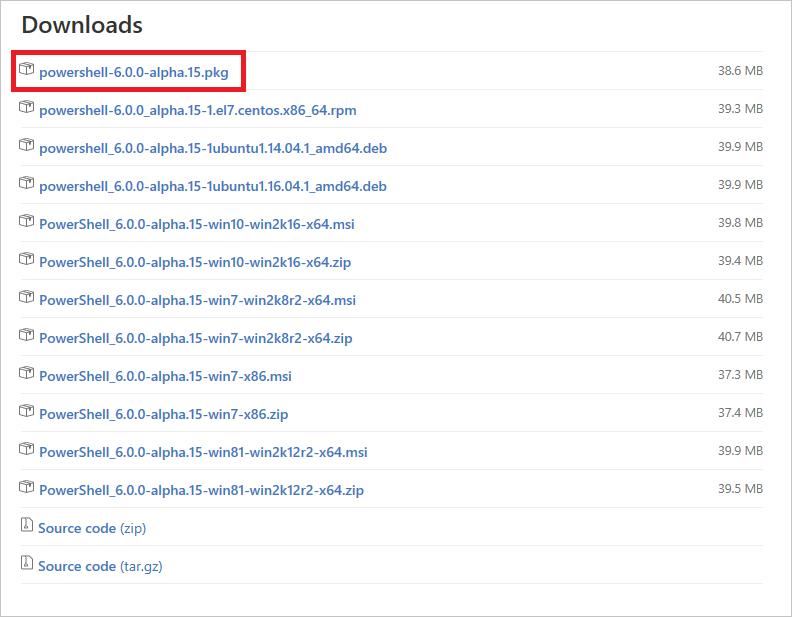
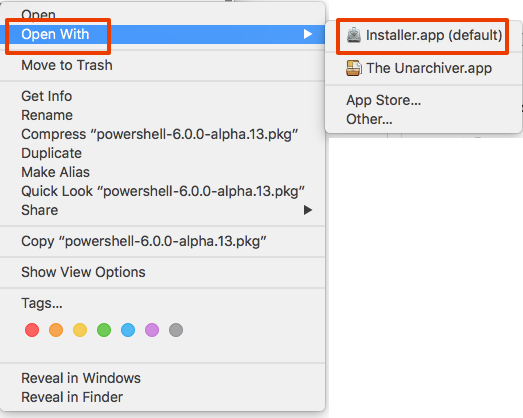
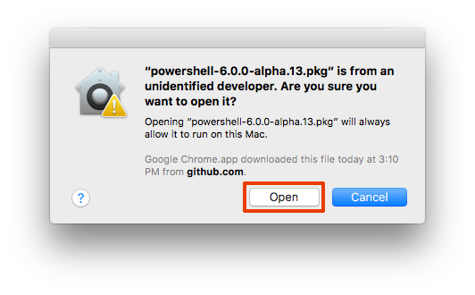
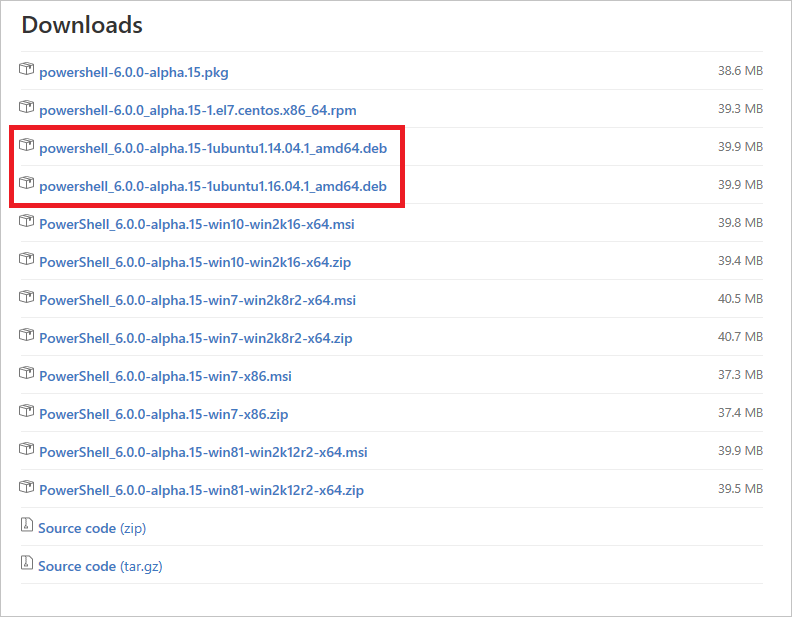
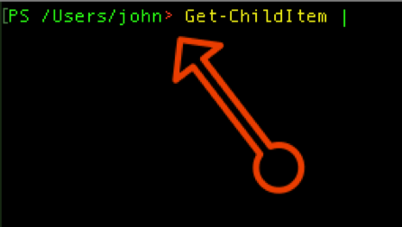

<a name="HOLTitle"></a>
# PowerShell for Linux and macOS #

---

<a name="Overview"></a>
## Overview ##

PowerShell has been available for Windows since 2006 and is a vital tool in the hands of software developers and sysadmins alike. In August 2016, Microsoft introduced PowerShell for Linux, macOS, and Windows as an [open-source project on GitHub](https://github.com/PowerShell/PowerShell). Microsoft works closely with the community to refine and expand the product and to make sure that it works equally well on any operating system and with a variety of Linux distros. For more information about where to get it, the many learning resources that are available, and how to contribute, see the [official announcement](https://blogs.msdn.microsoft.com/powershell/2016/08/18/powershell-on-linux-and-open-source-2/) in the Windows PowerShell blog.

PowerShell is both a command/terminal environment and a scripting tool. One of the more remarkable aspects of its architecture is that PowerShell commands are object-based. You use commands to manipulate the properties and methods on objects to achieve the result you want. Once you learn about the numerous objects available, formulating commands is a straightforward process that is not unlike manipulating objects in code.

In this lab, you will install PowerShell on the macOS or Linux and perform a few exercises to familiarize yourself with PowerShell and learn about a few of the many things it can do. Along the way, you will experience the "Zen of PowerShell" and build a foundation for further learning.

<a name="Objectives"></a>
### Objectives ###

In this hands-on lab, you will learn how to:

- Install and run PowerShell on Linux and macOS
- Working with and manipulating files
- Finding the right command (cmdlet) in PowerShell for accomplishing a task
- How to get help in PowerShell
- How to build complicated pipelines to accomplish a lot of work without coding

<a name="Prerequisites"></a>
### Prerequisites ###

The following are required to complete this hands-on lab:

- An Internet connection
- Sufficient permissions to install software on your Linux desktop or Mac
- Ubuntu 14.04 or 16.04 or CentOS/Oracle/Red Hat 7 or higher  (Linux users)
- macOS 10.11 or higher (Mac users)

---

<a name="Exercises"></a>
## Exercises ##

This hands-on lab includes the following exercises:

- [Exercise 1: Installing PowerShell on macOS](#Exercise1)
- [Exercise 2: Installing PowerShell on Ubuntu](#Exercise2)
- [Exercise 3: Installing PowerShell on CentOS/Oracle/Red Hat Linux](#Exercise3)
- [Exercise 4: Using the PowerShell Command Line](#Exercise4)
- [Exercise 5: Copying and Manipulating Files](#Exercise5)
- [Exercise 6: Working with the Contents of Files](#Exercise6)
 
Estimated time to complete this lab: **45** minutes.

<a name="Exercise1"></a>
## Exercise 1: Installing PowerShell on macOS ##

The first step in using PowerShell on a Mac is to download it and install it. Installation requires an Apple computer running macOS 10.11 (Yosemite) or higher. If you are using a Linux desktop operating system, please skip this exercise and go to [Exercise 2](#Exercise2) or [Exercise 3](#Exercise3). 

1. Open a browser and navigate to https://github.com/PowerShell/PowerShell/releases. Then click **Latest release**.

    

    _Finding the latest release_

1. Scroll down to the "Downloads" section for the latest release and click the **.pkg** file.

    

    _Downloading the macOS package_

1. Because of [App Sandbox](https://developer.apple.com/library/content/documentation/Security/Conceptual/AppSandboxDesignGuide/AboutAppSandbox/AboutAppSandbox.html) protections in macOS, you **cennot** just double-click the installer to run it. If you do, you will see the following message. This limitation will go away once PowerShell reaches beta because Microsoft will digitally sign the installer.

    

1. To install the PowerShell package, open Finder and navigate to the "Downloads" directory. Control-click the downloaded **.pkg** file, select **Open With**, and in the flyout menu, select **Installer (default)** (or "Installer.app (default)" if your Mac is configured to show file-name extensions).

    

    _Opening the downloaded package_

1. A sandbox warning will appear, but this one will have an Open button. Click the **Open** button to start the installation. Then follow the prompts to complete the installation.

    

1. If you want to use PowerShell's networking functionality, you will also need to install OpenSSL. Apple deprecated OpenSSL in favor of their own libraries. The easiest way to install it is to install [Homebrew](http://brew.sh/) and execute the following commands in a Terminal window. **This is an optional step** and is not required to complete this hands-on-lab.

    ```
    brew install openssl
    brew install curl --with-openssl
    ```

1. Once PowerShell is installed, open the Terminal application. Type `powershell` and press `Enter` to start PowerShell. If all went well during the installation, you will be placed at the PowerShell prompt. Note that the user name and prompt will probably be different on your computer.

    

Now skip to [Exercise 4](#Exercise4) to continue the lab. Exercises 2 and 3 are for Linux users only.

<a name="Exercise2"></a>
## Exercise 2: Installing PowerShell on Ubuntu ##

At present, PowerShell supports Ubuntu 14.04 and 16.04. If you are running either version, follow the instructions in this exercise to install PowerShell on your Ubuntu desktop. If you are running CentOS/Oracle/Red Hat Linux instead, skip to [Exercise 3](#Exercise3).

1. Open a Terminal window and check the Ubuntu version number by executing the following command:

    ```
    lsb_release -r
    ```

    If the reported version number is anything other than 14.04 or 16.04, please update your Ubuntu installation to one of those versions.

1. Open a browser and navigate to https://github.com/PowerShell/PowerShell/releases. Then click **Latest release**.

    

    _Finding the latest release_

1. Scroll down to the "Downloads" section for the latest release and click the **.deb** file that corresponds to your version of Ubuntu.

    

    _Downloading the Ubuntu package_

1. In the Terminal window, navigate to the directory that the **.deb** file was downloaded to. (For Mozilla Firefox, the default download location is "~/Downloads." Other browsers may differ.) Then execute the following commands, replacing *filename* with the name of the **.deb** file you downloaded:

    <pre>
    sudo dpkg -i <i>filename</i> 
    sudo apt-get install -f</pre>

    The `dpkg` command may report an error, but that will be fixed by the `apt-get` command.

1. Once PowerShell is installed, type `powershell` and press `Enter` to start PowerShell. If all went well during the installation, you will be placed at the PowerShell prompt. Note that the user name and prompt will probably be different on your computer.

    

    _Running PowerShell_

Now skip to [Exercise 4](#Exercise4) to continue the lab. Exercise 3 is for CentOS/Oracle/Red Hat Linux users only.

<a name="Exercise3"></a>
## Exercise 3: Installing PowerShell on CentOS/Oracle/Red Hat Linux ##

Microsoft loves Linux, as does the PowerShell team. If you are running CentOS 7, Oracle Linux 7, or Red Hat Enterprise 7, follow the instructions in this exercise to install PowerShell.

1. Open a Terminal window and check the version number of your operating system by executing the following command:

    ```
    cat /etc/*release*
    ```

    If you don't see the version number 7.0 or higher, please update your operating system.

1. Open a browser and navigate to https://github.com/PowerShell/PowerShell/releases. Then click **Latest release**.

    

    _Finding the latest release_

1. Scroll down to the "Downloads" section for the latest release and click the **.rpm** file.

    

    _Downloading the CentOS/Oracle Linux/Red Hat package_

1. In the Terminal window, navigate to the directory that the **.rpm** file was downloaded to. (For Mozilla Firefox, the default download location is "~/Downloads." Other browsers may differ.) Then execute the following commands, replacing *filename* with the name of the **.rpm** file you downloaded:

    <pre>
    sudo yum install ./<i>filename</i></pre>

1. Once PowerShell is installed, type `powershell` and press `Enter` to start PowerShell. If all went well during the installation, you will be placed at the PowerShell prompt. Note that the user name and prompt will probably be different on your computer.

    

    _Running PowerShell_

Now proceed to [Exercise 4](#Exercise4) to learn about the PowerShell command line. 

<a name="Exercise4"></a>
## Exercise 4: Using the PowerShell Command Line ##

PowerShell offers an outstanding command-line editing experience. More than just a place to type commands, the command line is a place to *discover* commands and the parameters passed to them. In this exercise, you will learn about basic command-line features because they are a terrific aid not only when you're learning PowerShell, but when you're using it day to day.

1. Start PowerShell by opening a Terminal window and executing the following command:

	```
	powershell
	```

1. The PowerShell command line supports auto-complete — not just for PowerShell commands (known as *cmdlets*), but for other programs installed on your computer. A great example is the vi editor. At the PowerShell prompt, you can simply type `vi` to launch vi. Or you can ask PowerShell to list all valid commands that begin with "vi."

	To demonstrate, type the following — the letters "vi" followed by two presses of the `Tab` key — at the PowerShell prompt:

    <pre>
    vi&lt;TAB&gt;&lt;TAB&gt;</pre>

    You will see something like this: 

    ```
    PS /Users/john/Documents> vi             
    vi        vifs      vimdiff   vipw      visudo
    view      vim       vimtutor  vis
	PS /Users/john/Documents> vi    
    ```

    `vi` still appears on the command line, so you can press `Enter` to launch it or continue typing. Or you can clear the command line by pressing `CTRL+C`.

1. If you are thinking that what you did in the previous step is exactly what Bash does, you are correct. Now let's try something a little more interesting. Type the following at the PowerShell command prompt: 

    <pre>
    Get-Chi&lt;TAB&gt;&lt;TAB&gt;</pre>

    After the second press of the `Tab` key, the command expands into `Get-ChildItem`, which is PowerShell's equivalent of the `ls` command.

1. It gets better. Add a space and a dash to the end of the command and press `Tab` twice:

    <pre>
    Get-ChildItem -&lt;TAB&gt;&lt;TAB&gt;</pre>

    PowerShell responds by listing all possible parameters to `Get-ChildItem`:

    <pre>
    Path                 Attributes           WarningAction
    LiteralPath          Directory            InformationAction
    Filter               File                 ErrorVariable
    Include              Hidden               WarningVariable
    Exclude              ReadOnly             InformationVariable
    Recurse              System               OutVariable
    Depth                Verbose              OutBuffer
    Force                Debug                PipelineVariable
    Name                 ErrorAction</pre>

    Of course, if you typed `-d` followed by the `Tab` key, you would only see parameters that start with the letter D.

    What is even more important is that any cmdlets you add to PowerShell, whether they're ones you wrote or ones written by others, benefit from full discoverability as well. It is just part of PowerShell.

1. Perhaps the most important feature of the PowerShell command line is that the prompt itself lets you know when there's an error. To see for yourself, type this at the PowerShell prompt, and then press `Enter`:

    <pre>
    Get-ChildItem |</pre>

    That is an invalid command because it is missing the cmdlet to the right of the | operator. Look carefully at the &gt; character in the prompt:

    

    The fact that it's red means there is an error. This quick error indicator is evaluated on each keystroke so that you know when the error is fixed.

	> The error indicator lights up when executing the command right now would result in a parsing error. It doesn't light up if the command is simply wrong or doesn't exist.

All of these features are part of the default command-line editing experience, but that experience is extensible. You can add modules to PowerShell to add syntax highlighting and other features to the command line. One such module is [PSReadLine](https://blogs.technet.microsoft.com/heyscriptingguy/tag/psreadline/), which was originally developed for Windows PowerShell and is now available for macOS and Linux, too.

<a name="Exercise5"></a>
## Exercise 5: Copying and Manipulating Files ##

`Get-ChildItem` is an example of a PowerShell cmdlet (pronounced "command-let"). It is one of more than 200 cmdlets that are currently included in PowerShell, and since you can write cmdlets of your own, there is no end to the number of commands you can execute at the PowerShell prompt. In this exercise, you will learn more about `Get-ChildItem` and other cmdlets for working with files. You will also learn about *pipelines*, which enable you to string cmdlets together to perform complex tasks.

1. You really only need to memorize three PowerShell cmdlets: `Get-Command`, `Get-Help`, and `Get-Member`. With these cmdlets, you can get all the information you need about other cmdlets. PowerShell follows a _verb-noun_ approach to naming, which you can read about in [Approved Verbs for Windows PowerShell Commands](https://msdn.microsoft.com/en-us/library/ms714428(v=vs.85).aspx). Accordingly, you will see that `Get` is the verb to "specify an action that retrieves a resource."

    At the PowerShell prompt, execute the following command to display the parameters to `Get-Command`:

    <pre>
    Get-Command -&lt;TAB&gt;&lt;TAB&gt;</pre>

    You will see a list of possible parameters: 

    <pre>
    Name                  Syntax                Verbose
    InformationVariable   Verb                  ShowCommandInfo
    Debug                 OutVariable           Noun 
    ArgumentList          ErrorAction           OutBuffer 
    Module                All                   WarningAction
    PipelineVariable      FullyQualifiedModule  ListImported          
    InformationAction     CommandType           ParameterName         
    ErrorVariable         TotalCount            ParameterType         
    WarningVariable</pre>

    Tucked away in the middle of the list is `Verb`. This is the one you use to find all the cmdlets that start with a specific verb. Use the following command to list all cmdlets that begin with `Get`:

    <pre>
    Get-Command -Verb Get</pre>

    The list is long. There is even a `Get-Verb` cmdlet that lists all of the verbs you can use.

1. Of all the `Get` cmdlets, the two that you will focus on for now are `Get-Item` and `Get-ChildItem`. These are the primary cmdlets PowerShell users use to list files and directories and the contents of directories. What is the difference between the two? Execute the following two commands and read the output carefully:

    <pre>
	Get-Help Get-Item
    Get-Help Get-ChildItem</pre>

    Both cmdlets "get" files and folders. The main difference is that `Get-Item` retrieves a single item, whereas `Get-ChildItem` returns all the files and folders in the specified path. To list the contents of a directory, `Get-ChildItem` is the cmdlet you want to use.

1. Viewing help information in a Terminal window is great for getting a quick read on what a cmdlet does, but when you want to dig deeper, you can go online by including `-online` in the command. To demonstrate, type the following command:

    <pre>
    Get-Help Get-ChildItem -online</pre>

    > If you are using Mozilla Firefox on CentOS or Ubuntu, you may see some extranious output in the Terminal window if Firefox wasn't already running.

1. Assuming you downloaded this lab as a zip file and expanded it to a local directory on your hard disk, use a `cd` command to navigate to the directory containing this lab (the directory containing the MD or HTML file you are reading). Then execute the following command to list the files and directories in the current directory:

    <pre>
    Get-ChildItem</pre>

	The output should include a subdirectory named "resources." Use the following command to view the contents of the "resources" directory:

    <pre>
    Get-ChildItem ./resources/ -Recurse</pre>

    You should find that the subdirectory contains 26 text files: a.txt, b.txt, and so on.

1. Now execute the following command to list all the cmdlets that begin with `Copy`:

    <pre>
    Get-Command -Verb Copy</pre>

    If you wanted to copy a file, which cmdlet do you think you might use? If you guessed `Copy-Item`, you are correct. This is such an important cmdlet, you should browse the examples in the online help:

    <pre>
    Get-Help Copy-Item -Online</pre>

1. Example 2 in the online help shows how to copy the contents of a directory to another directory, which you will do in a moment. But before you jump feet-first into doing a `Copy-Item`, however, it might help to understand precisely what the command will do.
 
	Enter PowerShell's most powerful parameter: `-WhatIf`. This parameter can save your job — especially if you're about to delete a bunch of files or recursively delete a bunch of directories. To demonstrate, type the following command to preview what the `Copy-Item` command will do when passed a specific set of parameters: 

    <pre>
    Copy-Item ./resources/ ./workspace -Recurse -WhatIf</pre>

    In this case, `Copy-Item` will copy the contents of the "resources" subdirectory to the "workspace" directory.

1. A good habit to get into with PowerShell is to be explicit with parameters so the results of a command don't depend on parameter order. To copy the files in the "resources" directory to the "workspace" directory (don't worry; the "workspace" directory will be created for you if it doesn't already exist), execute the following command and notice the explicit parameter usage:

    <pre>
    Copy-Item -Path ./resources/ -Destination ./workspace -Recurse</pre>

1. Now that the files have been copied, change to the "workspace" directory with the following command:

    <pre>
    cd workspace</pre>

1. Now that you know the basics of listing (and copying) files and directories, it is time to learn about the PowerShell pipeline. The first thing to realize is that you can use the piping operator | to "pipe" the output from one cmdlet to the input to another. The second thing to know is that in PowerShell, everything is an object. Even cmdlets return objects. Take this command, for example:

    <pre>
    Get-ChildItem | Get-Member</pre>

    The results show that the object returned by `Get-ChildItem` is an object whose type is *System.IO.FileInfo*. Furthermore, it lists the methods and properties available on that object.  The list is a little hard to read because the methods and properties aren't listed in alphabetical order. You can fix that by piping the output from `Get-Member` to the `Sort-Object` cmdlet and specifying a property name. The following command sorts the values returned by `Get-Member` on the *Name* property:

    <pre>
    Get-ChildItem | Get-Member | Sort-Object Name</pre>

1. Notice that alphabetized list contains a property named *FullName*. As you might suspect, this property returns the full name (path plus file name) of a file-system object. Suppose you wanted to list each file in the current directory using full names. You can use `ForEach-Object` to iterate over the files and display each file's *FullName* property. Demonstrate by executing the following command at the PowerShell prompt:

    <pre>
    Get-ChildItem | ForEach-Object FullName</pre>

    The command you just executed uses the newer format for `ForEach-Object` where you simply specify the property name. The old format, which is used by many of the examples found on the Internet and will always be supported (and can still be handy at times), looks like this:
    
    <pre>
    Get-ChildItem | ForEach-Object {$_.FullName}</pre>

1. The next task is to sort the list of files by their sizes, but in reverse order. One of the many properties present in *System.IO.FileInfo* objects is the *Length* property. What is the output when you execute the following command?

    <pre>
    Get-ChildItem | Sort-Object Length</pre>

    The default sort order is ascending, but check out the online help for `Sort-Object` to see if there might be a parameter for soring in descending order:

    <pre>
    Get-Help Sort-Object</pre>

1. Did you find the appropriate parameter? Use the following pipeline to see the results:

    <pre>
    Get-ChildItem | Sort-Object Length -Descending</pre>

1. The final task in this exercise is to list only the files that are between 800 and 1024 bytes in length (exclusive). Here, PowerShell's `Where-Object` cmdlet will come in handy, because it accepts a conditional expression. The conditional expression can use comparison operators such as `-lt` (less than), `-gt` (greater than), and `-and`. Here is the command that lists files of a certain size:

    <pre>
    Get-ChildItem | Where-Object {($_.Length -gt 800) -and ($_.Length -lt 1024)}</pre>

    Run the command and the output should look like this:

	<pre>
	Mode                LastWriteTime         Length Name
	----                -------------         ------ ----
	-a----       12/23/2016   9:36 AM            860 a.txt
	-a----       12/23/2016   9:36 AM            835 f.txt
	-a----       12/23/2016   9:36 AM           1003 i.txt
	-a----       12/23/2016   9:36 AM            946 t.txt
	-a----       12/23/2016   9:36 AM            815 y.txt
	-a----       12/23/2016   9:36 AM            863 z.txt</pre>

Constructing pipelines by using the piping operator to pipe output from one cmdlet to another, and using conditional expressions in those pipelines, is just one of the tools used by PowerShell users to accomplish file-system tasks. Of course, these concepts don't apply just to cmdlets that operate on the file system. They apply to *all* cmdlets, even custom ones that you use to extend PowerShell.

<a name="Exercise6"></a>
## Exercise 6: Working with the Contents of Files ##

It is time to take your PowerShell knowledge up a notch. In this exercise, you will learn how to work with the contents of files and how to find specific data in those files. You will also learn how to glean some interesting statistics from what you find. Be warned that you will be executing some complicated "one liners." That is PowerShell-speak for accomplishing a lot with a little and not having to write a program to do the same work.

1. You already know how to list files; now you need to know how look inside files. Because you will be working with text files in the "resources" directory included with this lab, you need to find cmdlets that can work with strings. Execute the following command and see if there is a cmdlet that might help:

    <pre>
    Get-Command *string*</pre>

    The `Get-Command` cmdlet happily accepts wildcards, so the results include all cmdlets with "string" in the name. One of those is `Select-String`. Pull up help for `Select-String` with the following command:

    <pre>
    Get-Help Select-String -Online</pre>

    Read carefully through the help to learn what the `Select-String` cmdlet can do.

1. Suppose you wanted to list all the lines containing "we" in the files in the current directory. The online help for `Select-String` reveals that it supports two parameters related to pattern matching: `-SimpleMatch` for basic string matching, and `-Pattern` for regular-expression matching. Execute the following command to demonstrate `-SimpleMatch`:

    <pre>
    Get-ChildItem | Select-String -SimpleMatch "we"</pre>

    That yields dozens of matches. Look through the output and see how many "we" strings you matched. 

1. The previous command listed lines containing "we", but it also listed lines containing "were," "wealthy," and "weather," among others. Suppose you *only* wanted to find lines containing the word "we." One solution might be to search for "we " ("we" with a space at the end). Execute the following command to see how well that works:

    <pre>
    Get-ChildItem | Select-String -SimpleMatch "we "</pre>

    This seems like a reasonable solution, but is it? What might you be missing here? Think about that for a moment. 

1. The previous command finds occurrences of "we" with a trailing space. But what happens if a line ends with "we" followed by a line break? What you *should* be searching for is "we" preceeded by either the start of the line or whitespace, and instances of "we" followed by either the end of the line or whitespace. That screams regular expressions. What is the old joke about regular expressions? "You have a problem and you solve it with a regular expression. Now you have two problems!" 

    Under the hood, PowerShell uses the .NET regular expression library. Here is the [Regular Expression Quick Reference](https://msdn.microsoft.com/en-us/library/az24scfc(v=vs.110).aspx), which is very helpful when working with regular expressions in PowerShell.

    For this step, the regular expression you want to use is `(^|\s)we($|\s)`. You can read this as "(beginline or whitespace)we(endline or whitespace)." Execute the following command at the PowerShell prompt:

    <pre>
    Get-ChildItem | Select-String -Pattern "(^|\s)we($|\s)"</pre>

    If you compare the output of the last two commands, you will see that the latter found one more line than the former. 

1. What if the goal was to count the number of times the word "we" appears in these text files? You could manually count the lines, but why not let PowerShell count them for you? All you need is a cmdlet to do the counting. Start by executing the following command to list all the verbs that you can use in a PowerShell command:

    <pre>
    Get-Verb</pre>

    Scroll down the list and pay attention to the "Diagnostic" group:

    <pre>
    Verb        Group
    ----        -----
    Debug       Diagnostic    
    Measure     Diagnostic    
    Ping        Diagnostic    
    Repair      Diagnostic    
    Resolve     Diagnostic    
    Test        Diagnostic    
    Trace       Diagnostic</pre>

    The verb `Measure` looks promising. Now list the cmdlets that start with `Measure` with the following command:

    <pre>
    Get-Command -Verb measure</pre>
    
    The output reveals two cmdlets — `Measure-Command` and `Measure-Object` — that look interesting. Use the following command to view the online help for the latter:

    <pre>
    Get-Help Measure-Object -Online</pre>

1. Now try piping the output from `Select-String` to `Measure-Object`:

    <pre>
    Get-ChildItem | Select-String -Pattern "(^|\s)we($|\s)" | Measure-Object</pre>

    The text includes a count, but it also includes a sum, an average, and other values that aren't relevant in this scenario:

    <pre>
    Count    : 6
    Average  : 
    Sum      : 
    Maximum  : 
    Minimum  : 
    Property :</pre>

1. Execute the following command, which uses `Select-Object` to filter out unwanted information:

    <pre>
    Get-ChildItem | Select-String -Pattern "(^|\s)we($|\s)" | Measure-Object | Select-Object Count</pre>

    Now the output tells you exactly what you wanted to know: how many times the word "we" appears in the text of the files that you searched.

1. `Measure-Object` is an extremely useful cmdlet. For example, to compute the total size of a set of files and to show the average length along with minimum and maximum lengths, you could do the following:

    <pre>
    Get-ChildItem | Measure-Object -Property Length -Average -Sum -Maximum -Minimum</pre>

    Try it and see. Pretty cool, huh?

1. How about a more complex example that really demonstrates the power of PowerShell? Suppose you want to replace all occurrences of "we" in the files with "nous," which is French for "we." Rather than write an app to do it, you can do it with PowerShell.

    A variable in PowerShell is represented as a dollar sign followed by the variable name. Some variables, such as `$PSVersionTable`, are built into PowerShell already. Execute the following command to see the value of that variable:

    <pre>
    $PSVersionTable</pre>

    This is a useful variable because it shows you which version of PowerShell you are running.

1. Now try the following command:

    <pre>
    Get-ChildItem  |
    Foreach-Object {
        $content = ($_ | Get-Content) 
        $content = $content -replace "(^|\s)we($|\s)"," nous "
        $content | Set-Content $_.FullName
    }</pre>

    This one-liner (it's technically just one command) gets the files in the current directory and pipes them to `Foreach-Object`. Inside the curly braces is a script block, where you can do pretty much anything you want. The first line reads the current file and writes its contents to the variable named `$content`. The second line does a search-and-replace on the value stored in the `$content` variable and assigns the result back to `$content`. The third line pipes the value of the `$content` variable to the `Set-Content` cmdlet, which writes the content to the current file, thus overwriting the original content.

    That is an amazing amount of work for a single command! You might be wondering why the replacement text is " nous " (notice the surrounding spaces) rather than "nous." That's because the regular expression matches the whitespace on both sides of "we," so if you don't put spaces around "nous," you will lose them.

1. To verify the replacement worked as intended, execute the following command:

    <pre>
    Get-ChildItem | Select-String "nous"</pre>

1. If you want to delete the "workspace" directory, use the following commands:

    <pre>
    cd ..
    Remove-Item ./workspace/ -Recurse -Force</pre>

This exercise covered a lot of ground. You learned how to search files for text using simple matches and regular expressions, and how to measure the number of items returned by a cmdlet. You also saw a one-liner that performs a search-and-replace. Use these as a starting point for exploring PowerShell on your own.

<a name="Summary"></a>
## Summary ##

In this hands-on lab you learned how to:

- Install and run PowerShell on Linux and macOS
- Working with and manipulating files
- Finding the right command (cmdlet) in PowerShell for accomplishing a task
- How to get help in PowerShell
- How to build complicated pipelines to accomplish a lot of work without coding

PowerShell is a wonderful addition to the open source world. Having a command line environment that makes for easy discoverability and avoids "pray-based parsing" is a huge boon to macOS and Linux. This hands-on lab tried to teach you the Zen of PowerShell so you have some confidence when staring at that blinking cursor.

To continue your PowerShell journey, take a good read of the [PowerShell documentation](https://msdn.microsoft.com/en-us/powershell/scripting/powershell-scripting). For macOS and Linux developers, Microsoft makes the free development environment, [Visual Studio Code](https://code.visualstudio.com/) and the free [PowerShell extension](https://marketplace.visualstudio.com/items?itemName=ms-vscode.PowerShell) to make it easy to write and debug one-liners and full scripts. Good luck on your journey!

https://technet.microsoft.com/en-us/library/ff714569.aspx

https://technet.microsoft.com/en-us/library/dd772285.aspx


----

Copyright 2016 Microsoft Corporation. All rights reserved. Except where otherwise noted, these materials are licensed under the terms of the MIT License. You may use them according to the license as is most appropriate for your project. The terms of this license can be found at https://opensource.org/licenses/MIT.