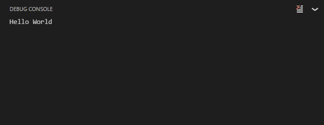
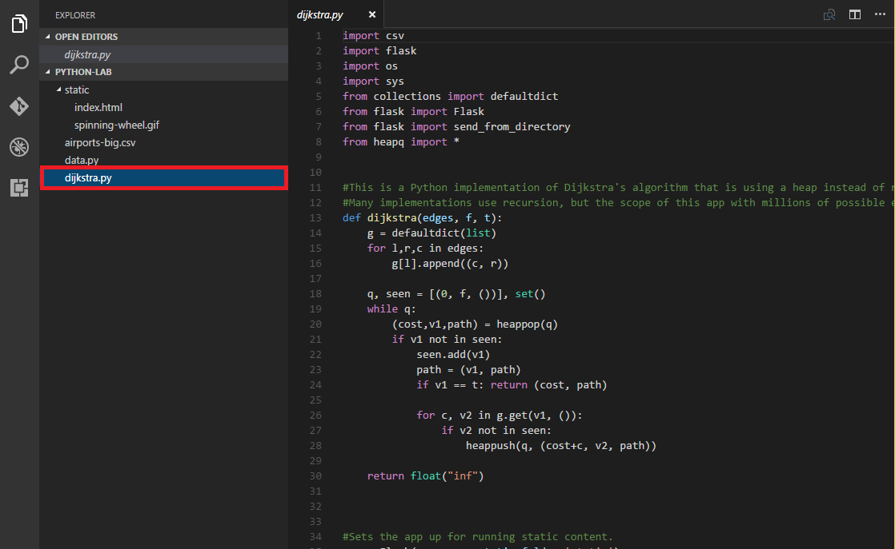
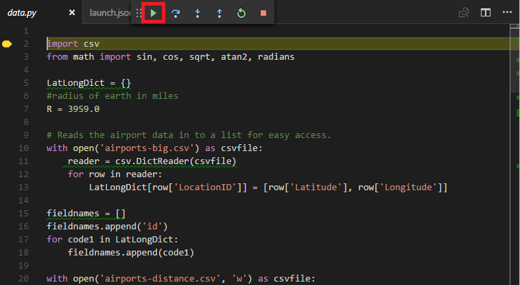
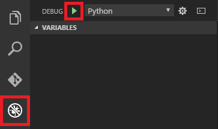
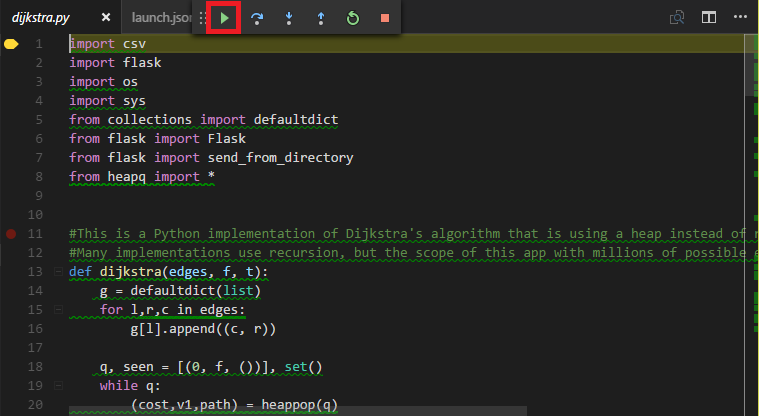
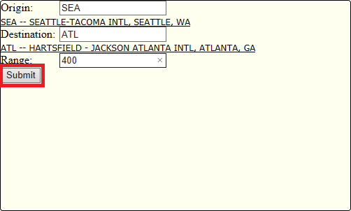

<a name="HOLTitle"></a>
# Using Python with Visual Studio Code #

---

<a name="Overview"></a>
## Overview ##

Python is a widely used programming language that is familiar to legions of developers. It features a dynamic type system and automatic memory manangement and is complemented by a comprehensive standard library as well as countless open-source libraries and frameworks, including [Django](http://www.djangoproject.com/), [Pyramid](http://www.pylonsproject.org/), [Flask](http://flask.pocoo.org/) and [Bottle](http://bottlepy.org/). Python interpreters are freely available for numerous operating systems, enabling Python developers to write apps that run cross-platform. Python enjoys wide support in academia and in the scientific and data-science communities, and is the programming language that powers popular Web sites such as [YouTube](https://www.youtube.com/), [DropBox](https://www.dropbox.com/), [Survey Monkey](https://www.surveymonkey.com/), [Reddit](https://www.reddit.com/), and [Yahoo Maps](https://maps.yahoo.com/b/).

Python code can be written with any code editor, including Microsoft's free, open-source, and cross-platform code editor, [Visual Studio Code](https://code.visualstudio.com). Combined with any of several freely available Python extensions, Visual Studio Code offers a [rich environment for writing, testing, and debugging Python code](https://code.visualstudio.com/docs/languages/python). And it works equally well on Windows, macOS, and Linux.

In this lab, you will use Visual Studio Code to create a Python app that computes the shortest routes between airports. The app, pictured below, runs in a browser and uses a Python back end to perform computations.


<a name="Objectives"></a>
### Objectives ###

In this hands-on lab, you will learn how to:

- Configure Visual Studio Code to write and test Python apps
- Use Visual Studio Code to pull code from GitHub

<a name="Prerequisites"></a>
### Prerequisites ###

The following are required to complete this hands-on lab:

- [Python](https://www.python.org/downloads/)
- [Visual Studio Code](https://code.visualstudio.com/download)
- [Git](https://git-scm.com/download)

---

<a name="Exercises"></a>
## Exercises ##

This hands-on lab includes the following exercises:

- [Exercise 1: Set up the environment](#Exercise1)
- [Exercise 2: Download an app and prepare the data](#Exercise2)
- [Exercise 3: Run the app](#Exercise3)

Estimated time to complete this lab: **30** minutes.

<a name="Exercise1"></a>
## Exercise 1: Set up the environment

Setting up Visual Studio Code to do Python development is fairly straightforward. It involves installing Python, installing Visual Studio Code, and then installing the Python Extension for Visual Studio Code. In this exercise, you will configure your environment for doing Python development with Visual Studio Code.

1. Visit https://www.python.org/downloads/ and download the installer for Python 3 for your operating system. Then run the installer to install Python 3. If the installer offers an option for including Python in your PATH, be sure to select this option.
 
	

	_Installing Python_

1. Visit https://code.visualstudio.com/ and download and install Visual Studio Code.

1. Create a directory named "PythonLab" in the location on your choice to serve as the project directory.

1. Start Visual Studio Code and use the **File -> Open Folder** command (on a Mac, **File -> Open**) to open the folder you created in the previous step.

1. Click the **Extensions** button in the ribbon on the left side in Visual Studio Code. Type "python" (without quotation marks) into the search box, and then click the **Install** button for the Python extension by Don Jayamanne.

	

	_Installing the Python extension_

1. Once the extension is installed, click the **Reload** button that appears where the **Install** button appeared before.

1. Use the **File -> New File** command to crate a new file. Then add the following line of Python code to the file:

	```
	print("Hello World")
	```

1. Use the **File -> Save** command to save the file, and name it "test.py." If Visual Studio Code displays an error message saying "Linter pylint is not installed," click **Install pylint** to install pylint.

	> [pylint](https://www.pylint.org/) is a popular linting tool for Python. Visual Studio Code uses it to check for common programming errors in your code.

	

	_Installing pylint_

1. Click the **Debug** button in the ribbon on the left. Then click the gear icon and select **Python** from the drop-down list that appears. Visual Studio responds by adding a file named **launch.json** to the project containing configuration information for Python projects. 

	

	_Adding launch.json_

1. Click **test.py** to make it the current file in the editor. Then click the **Start Debugging** button (the green arrow) to run the app.

	> If you are running Windows and see a dialog warning you that "Windows Firewall has blocked some features of this app," click the **Allow access** button.

	

	_Running the app in the debugger_

1. The app will start and the debugger will break at the first (and only) line. Click the **Continue** button (the green arrow) to continue executing the app.

	

	_Continuing in the debugger_
	
1. Confirm that the output "Hello World" appears in the debug console.

	

	_Output from test.py_

Now that Python is installed and Visual Studio Code is configured to run Python apps, you are ready to build and test more sophisticated apps. In the next exercise, you will downloaded an app from GitHub, inspect it in Visual Studio Code, and run a Python script to generate a data file that the app relies on.

<a name="Exercise2"></a>
## Exercise 2: Download an app and prepare the data

Visual Studio Code has integrated support for Git and GitHub, which makes it easy to pull projects from GitHub and work on them locally. In this exercise, you will download a Python app from GitHub and run a Python script to create a data file that the app relies on.

The app consists of two parts: a client half and a server half. The web services run on a lightweight web framework called [Flask](http://flask.pocoo.org/). Flask is an easy to use web framework with an integrated HTTP server. Flask uses decorators on the code to route URL to methods in the appplication. It is the only external dependency the application has that needs to be installed. The other part of the application is web page that uses standard web technologies like HTML, CSS, and JavaScript, which is contained in the "static" folder. Flask will also serve up the HTML as well. The HTML frontend combined with a Python backend is a common application architecture called [Single Page Applications](https://en.wikipedia.org/wiki/Single-page_application).

The app itself downloaded from GitHub is part practical and part theoretical in that it implements [Dijkstra's algorithm](https://en.wikipedia.org/wiki/Dijkstra's_algorithm) in a practical way. Dijkstra's algorithm finds the short distance between two nodes on a weighted graph. The app uses a distance table for all the General Aviation airports in the "Lower 48" states. A distance table contains a set of rows and columns wherein all the points of interest have both a row and column. The intersection of the points of interest contains the distance between the points of interest. The example below shows distances between European cities. 


The user selects a origin airport, destination airport, and a range in miles. The app then constructs in memory from the distance table a weighted graph where each airport is a node and each straight-line flight path is an edge. It will only create edges between nodes where the nodes are less than the supplied range. After the graph is created, it applies the algorithm to calculate the shortest path between the two airports.


1. If Git isn't installed on your computer, go to https://git-scm.com/download and install it now.

	> One way to determine whether Git is installed is to open a terminal window or Command Prompt window and execute a **git** command.

1. In Visual Studio Code, use the **View -> Integrated Terminal** command to open an integrated terminal. Then execute a **cd** command in the TERMINAL window to navigate to the directory where you would like the project you download from GitHub to be stored.

1. Execute the following command in the TERMINAL window to clone a GitHub repository:

	```
	git clone https://github.com/theonemule/python-lab/
	```

	This will create a directory named "python-lab" in the current directory.

1. Use the **File -> Open Folder** command (on a Mac, **File -> Open**) to open the folder you created in the previous step.

1. Expand the "static" folder in EXPLORER and click **index.html** to open **index.html** in the editor. Take a moment to examine its content. This is the Web front-end for the application. When it loads into a browser, it creates a Google map in the \<div\> whose id is "map." The API for creating and manipulating the map comes from https://maps.googleapis.com/maps/api/js, which is loaded with a \<script\> element near the bottom of the file.

	

	_Examining index.html_

1. Click **dijkstra.py** to open **dijkstra.py** in the editor. Take a moment to examine the code inside. This code, which runs on the server, uses Dijkstra's algorithm to compute the shortest path between two points given a set of intermediate points representing possible waypoints. It exposes this functionality through a REST API backed by Flask, which is a lightweight Web framework for Python.

	

	_Examining dijkstra.py_

1. Click **data.py** to open **data.py** in the editor. Take a moment to examine the code. Before the application can run, it needs a distance table created from the airport latitudes and longitudes in **airports-big.csv**. **data.py** contains the script that builds the distance table and stores it in a file **airport-distance.csv**. The app reads this file and calculates the distance between airports using a distance formula for two points on a sphere.

	

	_Examining data.py_

1. Click the **Debug** button in the ribbon on the left. Then click the gear icon and select **Python** from the drop-down list.

	

	_Configuring the environment for Python_

1. Return to **data.py** in the editor. Run it by clicking the **Start Debugging** button (the green arrow).

	

	_Running the app in the debugger_

1. When the debugger breaks on the first line of code, click the **Continue** button (the green arrow).

	

	_Continuing in the debugger_
	
1. Watch the debug console for output. The script will take several minutes to run, given that it is CPU-intensive and it's calculating more 20 million distances!

	

	_Output from data.py_

With the code loaded into Visual Studio Code and the distance table prepared, the next task is to run the app and put Dijkstra's algorithm to work finding the shortest distance between airports.

<a name="Exercise3"></a>
## Exercise 3: Run the app

Before you can run the app, you need to install Flask. You can do that from inside Visual Studio Code using the INTEGRATED TERMINAL window. In this exercise, you will install Flask, and then run the app in a browser and use it to compute the shortest route between airports.

1. Use Visual Studio Code's **View -> Integrated Terminal** command to open an INTEGRATED TERMINAL window.

1. Execute the following command in the INTEGRATED TERMINAL to install Flask. 

	```
	pip3 install flask
	```

1. Select **dijkstra.py** to make it the currently selected file. Then click the **Debug** button in the ribbon on the left, and click the **Start Debugging** button.

	

	_Running the app in the debugger_

1. When the debugger breaks on the first line, click the **Continue** button.

	

	_Continuing in the debugger_
	
1. Open a browser and navigate to http://127.0.0.1:5000/index.html.

1. Type "SEA" (without quotation marks) into the **Origin** field, "ATL" into the **Destination** field, and "400" into the **Range** field. Then click the **Submit** button to compute the best route from Seattle (SEA) to Atlanta (ATL) in a plane that has a 400-mile range.

	

	_Computing a route_

1. After a couple of minutes, the best route will appear on the map.

	

	_Best route from SEA to ATL_

1. Click the **Reset** button and try computing additional routes using different destinations and ranges. You can choose from more than 4,500 different airport codes. If you would like, bring up the debug console in Visual Studio Code while a computation runs to see how it's progressing.

	

	_Monitoring the progress of a computation_

When you are finished experimenting, click the **Stop** button in the debugging toolbar to stop the application. Anytime you wish to fire it up again, simply start **dijkstra.py** in the debugger and open your browser to http://127.0.0.1:5000/index.html.


_Stopping the debugger_

## Summary ##

Visual Studio Code.

---

Copyright 2016 Microsoft Corporation. All rights reserved. Except where otherwise noted, these materials are licensed under the terms of the MIT License. You may use them according to the license as is most appropriate for your project. The terms of this license can be found at https://opensource.org/licenses/MIT.